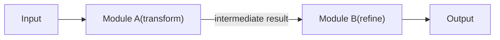

# 1.4: Custom Modules - Composing Complex Programs

## Introduction

In the last post, you learned that built-in modules like `Predict`, `ChainOfThought`, and `ReAct` wrap signatures with execution strategies. But real applications rarely consist of a single LM call. They chain multiple calls together, e.g., retrieve context, then reason over it; generate an answer, then verify it; classify a document, then extract entities based on the class.

That's where **custom modules** come in. A custom module is a Python class that composes sub-modules, Python logic, and data flow into a coherent program. It's the DSPy equivalent of building a neural network by stacking layers in PyTorch, except your "layers" are LM calls, and your "forward pass" is the control flow that connects them.

In this post, you'll learn how to build custom modules from scratch, compose them into multi-step pipelines, inspect their parameters, and save/load them for reuse.

---

## What You'll Learn

- The `dspy.Module` subclass pattern: `__init__` declares sub-modules, `forward` defines control flow
- How to compose modules inside modules, chaining predictions together
- The **layer pattern**: one module feeds its output into another
- Building a **RAG module** as a multi-step pipeline
- Inspecting module parameters with `named_predictors()` and `parameters()`
- Saving and loading programs with `save()` and `load()`
- Design patterns and best practices for module architecture

---

## Prerequisites

- Completed [1.3: First Modules - Predict, CoT, PoT, and ReAct](../1.3-first-modules/blog.md)
- DSPy installed (`uv add dspy`)
- A configured language model (we'll use `openai/gpt-4o-mini` in examples)

---

## The dspy.Module Pattern

Every custom module follows the same two-method pattern:

1. **`__init__`**: declare your sub-modules (predictors, other custom modules)
2. **`forward`**: define the control flow that wires them together

Here's the simplest possible custom module:

```python
import dspy
from dotenv import load_dotenv

load_dotenv()

lm = dspy.LM("openai/gpt-4o-mini")
dspy.configure(lm=lm)


class SimpleQA(dspy.Module):
    def __init__(self):
        self.answer = dspy.ChainOfThought("question -> answer")

    def forward(self, question):
        return self.answer(question=question)


qa = SimpleQA()
result = qa(question="What causes tides?")
print(result.answer)
# The gravitational pull of the Moon and the Sun...
```

This wraps a single `ChainOfThought` call, not very useful on its own. But the pattern becomes powerful the moment you add a second sub-module.

### Why Not Just Call Modules Directly?

You absolutely *can* use modules without wrapping them in a class. But wrapping them gives you three critical advantages:

1. **Optimization.** DSPy optimizers discover and tune all sub-modules declared in `__init__`. If your predictor isn't a named attribute of a `dspy.Module`, the optimizer can't find it.
2. **Composition.** Custom modules can be nested inside other custom modules, building arbitrarily deep pipelines.
3. **Serialization.** `save()` and `load()` capture the state of all sub-modules, their optimized prompts, few-shot examples, and weights.

---

## Composing Modules: The Layer Pattern

The most common composition pattern is **layering**: one module's output feeds into the next module's input. Think of it as a pipeline where each step refines, enriches, or transforms the data.



### Generate, Then Verify

```python
class VerifiedAnswer(dspy.Module):
    def __init__(self):
        self.generate = dspy.ChainOfThought("question -> answer")
        self.verify = dspy.Predict(
            "question, proposed_answer -> is_correct: bool, final_answer"
        )

    def forward(self, question):
        # Step 1: Generate an initial answer
        prediction = self.generate(question=question)

        # Step 2: Verify it
        verification = self.verify(
            question=question,
            proposed_answer=prediction.answer
        )

        # Use the corrected answer if the original was wrong
        if verification.is_correct:
            return dspy.Prediction(answer=prediction.answer)
        return dspy.Prediction(answer=verification.final_answer)


qa = VerifiedAnswer()
result = qa(question="What is the square root of 169?")
print(result.answer)
# 13
```

Two LM calls, connected by Python logic. The `generate` step uses `ChainOfThought` for reasoning; the `verify` step uses `Predict` for a quick binary check. DSPy can optimize each independently.

### Summarize, Then Translate

```python
class SummarizeAndTranslate(dspy.Module):
    def __init__(self):
        self.summarize = dspy.ChainOfThought("document -> summary")
        self.translate = dspy.Predict("text, target_language -> translation")

    def forward(self, document, target_language="Spanish"):
        summary = self.summarize(document=document)
        translated = self.translate(
            text=summary.summary,
            target_language=target_language
        )
        return dspy.Prediction(
            summary=summary.summary,
            translation=translated.translation
        )


pipeline = SummarizeAndTranslate()
result = pipeline(
    document="The James Webb Space Telescope launched in December 2021...",
    target_language="French"
)
print(result.summary)
print(result.translation)
```

Notice how `forward` accepts the same arguments your caller passes in, and returns a `dspy.Prediction` with whatever fields you want to expose. You control the interface completely.

---

## Building a RAG Module

Retrieval-Augmented Generation (RAG) is the canonical multi-step pattern: retrieve relevant context, then generate an answer grounded in that context. Here's a clean DSPy implementation:

```python
import dspy
from dotenv import load_dotenv

load_dotenv()

lm = dspy.LM("openai/gpt-4o-mini")
dspy.configure(lm=lm)


# A simple search function; in production, this would query a vector database
def search(query):
    """Search for relevant passages."""
    # Simulated retrieval; replace with your actual retrieval logic
    passages = {
        "python": ["Python was created by Guido van Rossum and released in 1991.",
                    "Python emphasizes code readability and simplicity."],
        "rust": ["Rust is a systems programming language focused on safety.",
                  "Rust was first released in 2015 by Mozilla Research."],
    }
    for key, docs in passages.items():
        if key in query.lower():
            return docs
    return ["No relevant information found."]


class RAG(dspy.Module):
    def __init__(self):
        self.respond = dspy.ChainOfThought("context, question -> response")

    def forward(self, question):
        context = search(question)
        return self.respond(context=context, question=question)


rag = RAG()
result = rag(question="Who created Python?")
print(result.response)
# Guido van Rossum created Python.
```

The beauty of this pattern is its simplicity: retrieval is just a Python function, and the module focuses purely on the LM call. You can swap the search function from a mock to Pinecone to Elasticsearch without touching the module.

---

## Multi-Step Pipelines

Custom modules can nest inside other custom modules, just like layers in a neural network. Here's a three-step pipeline that retrieves, answers, and then critiques the answer:

```python
class Critic(dspy.Module):
    def __init__(self):
        self.critique = dspy.ChainOfThought(
            "question, answer, context -> score: float, feedback"
        )

    def forward(self, question, answer, context):
        return self.critique(
            question=question, answer=answer, context=context
        )


class RAGWithCritic(dspy.Module):
    def __init__(self):
        self.rag = RAG()            # Reuse the RAG module from above
        self.critic = Critic()       # Nest another custom module

    def forward(self, question):
        # Step 1–2: Retrieve and generate (handled by RAG)
        rag_result = self.rag(question=question)

        # Step 3: Critique the answer
        context = search(question)
        critique = self.critic(
            question=question,
            answer=rag_result.response,
            context=context
        )

        return dspy.Prediction(
            response=rag_result.response,
            score=critique.score,
            feedback=critique.feedback
        )


pipeline = RAGWithCritic()
result = pipeline(question="What is Rust known for?")
print(f"Answer: {result.response}")
print(f"Score: {result.score}")
print(f"Feedback: {result.feedback}")
```

The `RAGWithCritic` module contains a `RAG` module (itself a custom module) and a `Critic` module. DSPy sees through the nesting, all predictors (`RAG.respond`, `Critic.critique`) are discoverable and optimizable.

---

## Module Parameters and Inspection

Every `dspy.Module` tracks the predictors declared in `__init__`. You can inspect them programmatically, a feature that's essential for debugging and understanding what an optimizer will tune.

### `named_predictors()`

Returns a list of `(name, predictor)` tuples for all predictor sub-modules:

```python
pipeline = RAGWithCritic()

for name, predictor in pipeline.named_predictors():
    print(f"{name}: {predictor}")

# rag.respond: ChainOfThought(...)
# critic.critique: ChainOfThought(...)
```

This shows the full path through the module hierarchy. The optimizer uses these paths to attach optimized prompts and demos to each predictor individually.

### `parameters()`

Returns a flat list of all trainable parameters (predictors) in the module tree:

```python
params = pipeline.parameters()
print(f"Total predictors: {len(params)}")
# Total predictors: 2
```

### `named_sub_modules()`

If your custom module contains other custom modules (not just predictors), you can inspect the full tree:

```python
for name, module in pipeline.named_sub_modules():
    print(f"{name}: {type(module).__name__}")

# rag: RAG
# rag.respond: ChainOfThought
# critic: Critic
# critic.critique: ChainOfThought
```

---

## Saving and Loading Programs

Once you've built (and optionally optimized) a module, you can save its entire state, including any few-shot demos, optimized instructions, and configuration and reload it later.

### Saving

```python
# Build and (optionally) optimize your program
rag = RAG()

# Save to a JSON file
rag.save("my_rag_program.json")
```

The saved file contains the state of every predictor in the module hierarchy: their signatures, any attached demos (few-shot examples added by optimizers), and instructions.

### Loading

```python
# Create a fresh instance with the same architecture
rag_loaded = RAG()

# Load the saved state
rag_loaded.load("my_rag_program.json")

# Use it exactly as before
result = rag_loaded(question="Who created Python?")
print(result.response)
```

> **Tip:** The class definition must match when loading. DSPy loads state *into* an existing module instance, it doesn't recreate the class from the file. If you change `__init__` (add or remove sub-modules), old save files may not load correctly.

### What Gets Saved?

| Saved | Not Saved |
|-------|-----------|
| Predictor signatures | Python logic in `forward` |
| Few-shot demos (from optimization) | External functions (search, APIs) |
| Optimized instructions | LM configuration |
| Field descriptions | Environment variables |

This means your `forward` logic and any external dependencies (search functions, database connections) must be present in the code when you load. The save file captures the *learned state*, not the entire program.

---

## Design Patterns and Best Practices

After building many DSPy programs, some patterns consistently produce clean, maintainable, and optimizable code.

### 1. One Responsibility Per Predictor

Each predictor should do one focused thing. Don't cram classification, extraction, and summarization into a single signature. Split them into separate predictors and compose them in `forward`.

### 2. Name Sub-Modules Descriptively

```python
# Good: names describe what each predictor does
self.classify = dspy.Predict("ticket -> priority")
self.extract = dspy.ChainOfThought("ticket, priority -> entities: list[str]")

# Bad: generic names make debugging harder
self.step1 = dspy.Predict("ticket -> priority")
self.step2 = dspy.ChainOfThought("ticket, priority -> entities: list[str]")
```

### 3. Return `dspy.Prediction`

Always return a `dspy.Prediction` from `forward`. This keeps the interface consistent and lets downstream modules and evaluators access outputs by name:

```python
return dspy.Prediction(answer=answer, confidence=score)
```

### 4. Keep `forward` Logic Simple

Your `forward` method should read like pseudocode: call A, check condition, call B, return result. Push complex logic into helper functions or separate modules.

### 5. Design for Optimization

Every predictor you want the optimizer to tune **must** be declared as `self.something` in `__init__`. Predictors created inside `forward` are invisible to the optimizer.

```python
# Optimizable: declared in __init__
def __init__(self):
    self.answer = dspy.ChainOfThought("question -> answer")

# NOT optimizable: created on the fly
def forward(self, question):
    temp = dspy.Predict("question -> answer")  # Optimizer can't see this!
    return temp(question=question)
```

### 6. Use Conditional Logic Freely

`forward` is plain Python. Use `if/else`, loops, error handling, whatever you need:

```python
def forward(self, question, use_reasoning=True):
    if use_reasoning:
        return self.cot(question=question)
    return self.predict(question=question)
```

---

## Key Takeaways

- **Custom modules follow a two-method pattern:** `__init__` declares sub-modules, `forward` defines control flow.
- **The layer pattern**: output of one module feeds into the next. This is one of the most common composition strategies.
- **RAG is a natural fit** for DSPy modules: retrieval is a Python function, generation is a predictor.
- **Modules nest freely.** Custom modules inside custom modules create arbitrarily deep pipelines, and DSPy sees through the nesting for optimization.
- **`named_predictors()`** and **`parameters()`** let you inspect every tunable component in your pipeline.
- **`save()` and `load()`** serialize the learned state (demos, instructions) but not the Python logic, your class definition must match.
- **Declare all predictors in `__init__`** so optimizers can discover and tune them.

---

## Next Up

You've mastered the fundamentals: signatures, modules, and custom composition. Time to put it all together. In the next post, you'll build a complete text classifier from scratch using everything you've learned in Phase 1.

**[1.P: Mini-Project - Building a Text Classifier →](../1.P-mini-project-text-classifier/blog.md)**

---

## Resources

- [DSPy Modules Documentation](https://dspy.ai/learn/programming/modules/)
- [DSPy Custom Modules Tutorial](https://dspy.ai/tutorials/custom_module/)
- [DSPy Save/Load API](https://dspy.ai/api/modules/Module/)
- [DSPy GitHub Repository](https://github.com/stanfordnlp/dspy)
- [Code examples for this post](code/)
