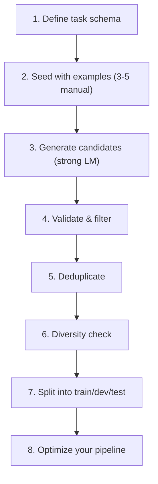

# 3.4: Synthetic Dataset Bootstrapping

## Introduction

In [3.1: Building Eval Sets](../3.1-building-eval-sets/blog.md), you learned how to load and structure evaluation data. But there's a harder question hiding underneath: **where does that data come from in the first place?**

In the real world, labeled data is expensive. Domain experts charge by the hour. Internal datasets are locked behind compliance gates. And for novel tasks, labeled examples simply don't exist yet. This is the single biggest bottleneck in deploying DSPy programs: you can't optimize what you can't evaluate, and you can't evaluate without data.

The solution is **synthetic dataset bootstrapping** - using a powerful LM to generate, filter, and curate training and evaluation data programmatically. When done right, synthetic data lets you bootstrap a complete optimization pipeline in hours instead of weeks. When done wrong, you train on hallucinated garbage. This post shows you how to do it right.

---

## What You'll Learn

- Why synthetic data matters for DSPy optimization
- Using `dspy.ChainOfThought` as a data generator with controlled output schemas
- Filtering techniques: deduplication, diversity scoring, quality validation
- Building train/dev/test splits from synthetic data
- End-to-end example: generating 200 QA pairs, filtering to 150, optimizing a pipeline
- When synthetic data beats human-labeled data, and when it doesn't

---

## Prerequisites

- Completed [3.1: Building Eval Sets](../3.1-building-eval-sets/blog.md)
- DSPy installed (`uv add dspy python-dotenv`)
- An OpenAI API key (GPT-4o recommended for generation; GPT-4o-mini works for the optimized pipeline)

---

## Why Synthetic Data?

DSPy's optimizers need data to work. Here's the practical reality:

| Optimizer | Minimum Data | Ideal Data | What It Uses Data For |
|-----------|-------------|------------|----------------------|
| BootstrapFewShot | 10 examples | 50-200 | Selecting few-shot demonstrations |
| MIPROv2 | 20 examples | 100-500 | Instruction + demo search |
| GEPA | 50 examples | 200-1000 | Reflective prompt evolution |
| BootstrapFinetune | 100 examples | 500-5000 | Fine-tuning weight updates |

The problem: getting 200+ high-quality, labeled examples for a custom task is expensive and slow. Synthetic generation solves this by using a strong model (GPT-4o, Claude 3.5 Sonnet) to produce training data for a weaker model or for prompt optimization.

> **Key insight:** You're not cheating. You're using a teacher model's knowledge as training signal, the same principle behind knowledge distillation. The optimizer still needs to prove the optimized program works on real evaluation data.

---

## The Bootstrapping Pipeline

The process follows a clear pipeline:



Let's build each step.

---

## Step 1: Define Your Task Schema

Before generating data, define exactly what your examples should look like. This is your contract:

```python
import dspy
from pydantic import BaseModel, Field

# What each example looks like
class QAExample(BaseModel):
    question: str = Field(description="A clear, specific question")
    answer: str = Field(description="A concise, factual answer (1-3 sentences)")
    difficulty: str = Field(description="easy, medium, or hard")
    topic: str = Field(description="The subject area of the question")
```

This schema drives both generation and validation. Every generated example must conform to it.

---

## Step 2: Seed with Manual Examples

Give the generator a few manually written examples to establish the pattern and quality bar:

```python
seed_examples = [
    {
        "question": "What is the difference between a list and a tuple in Python?",
        "answer": "Lists are mutable (can be modified after creation) while tuples are immutable. Lists use square brackets [], tuples use parentheses ().",
        "difficulty": "easy",
        "topic": "python-basics"
    },
    {
        "question": "How does garbage collection work in Python?",
        "answer": "Python uses reference counting as its primary mechanism, supplemented by a cyclic garbage collector that detects and collects reference cycles. Objects are freed when their reference count drops to zero.",
        "difficulty": "hard",
        "topic": "python-internals"
    },
    {
        "question": "What is a decorator in Python?",
        "answer": "A decorator is a function that takes another function as input and extends its behavior without modifying its source code. They use the @decorator_name syntax above a function definition.",
        "difficulty": "medium",
        "topic": "python-functions"
    },
]
```

Three to five seed examples is usually sufficient. They teach the generator your style, depth, and domain focus.

---

## Step 3: Build the Generator

Use `dspy.ChainOfThought` with a carefully designed signature to produce batches of examples:

```python
import dspy
import json

# Configure with a strong model for generation
teacher_lm = dspy.LM("openai/gpt-4o", temperature=0.9)  # High temperature for diversity
dspy.configure(lm=teacher_lm)


class GenerateExamples(dspy.Signature):
    """Generate diverse, high-quality question-answer pairs for a Python programming quiz.
    Each example should be factually accurate, specific, and cover different subtopics.
    Vary the difficulty levels. Do NOT repeat questions similar to the seed examples."""

    seed_examples: str = dspy.InputField(desc="Existing examples to match in style and quality")
    topic_focus: str = dspy.InputField(desc="Specific topic area to generate questions about")
    num_examples: int = dspy.InputField(desc="Number of examples to generate")
    examples_json: str = dspy.OutputField(desc="JSON array of generated examples with question, answer, difficulty, topic fields")


generator = dspy.ChainOfThought(GenerateExamples)


def generate_batch(seed_examples, topic, batch_size=10):
    """Generate a batch of examples for a specific topic."""
    result = generator(
        seed_examples=json.dumps(seed_examples, indent=2),
        topic_focus=topic,
        num_examples=batch_size,
    )

    try:
        examples = json.loads(result.examples_json)
        return examples
    except json.JSONDecodeError:
        print(f"Failed to parse JSON for topic: {topic}")
        return []
```

The high temperature (0.9) ensures diversity. We generate in topical batches to cover the domain evenly.

---

## Step 4: Generate Across Topics

Spread generation across multiple topics to ensure coverage:

```python
topics = [
    "python-basics",
    "data-structures",
    "python-functions",
    "object-oriented-programming",
    "error-handling",
    "file-io",
    "python-internals",
    "standard-library",
    "concurrency",
    "testing",
]

all_generated = []

for topic in topics:
    batch = generate_batch(seed_examples, topic, batch_size=20)
    all_generated.extend(batch)
    print(f"Generated {len(batch)} examples for {topic}")

print(f"\nTotal generated: {len(all_generated)} raw examples")
```

With 10 topics and 20 per batch, this produces around 200 raw candidates. Cost is typically under $2 with GPT-4o.

---

## Step 5: Validate and Filter

Not every generated example is good. Apply structured validation:

```python
from pydantic import ValidationError


def validate_example(example):
    """Validate a single example against the schema and quality criteria."""
    # Schema validation
    try:
        QAExample(**example)
    except (ValidationError, TypeError):
        return False, "schema_error"

    # Quality checks
    if len(example.get("answer", "")) < 20:
        return False, "answer_too_short"

    if len(example.get("question", "")) < 15:
        return False, "question_too_short"

    if example.get("difficulty") not in ("easy", "medium", "hard"):
        return False, "invalid_difficulty"

    # Check for placeholder/generic content
    bad_phrases = ["for example", "such as", "etc.", "and so on"]
    answer = example.get("answer", "").lower()
    if any(phrase in answer for phrase in bad_phrases):
        return False, "vague_answer"

    return True, "valid"


# Filter
validated = []
rejection_reasons = {}

for ex in all_generated:
    is_valid, reason = validate_example(ex)
    if is_valid:
        validated.append(ex)
    else:
        rejection_reasons[reason] = rejection_reasons.get(reason, 0) + 1

print(f"Validated: {len(validated)} / {len(all_generated)}")
print(f"Rejections: {rejection_reasons}")
```

A 15-25% rejection rate is typical and healthy. If you're rejecting more than 50%, refine your generator prompt.

---

## Step 6: Deduplicate

LLMs love generating similar examples. Remove near-duplicates:

```python
def deduplicate(examples, threshold=0.85):
    """Remove near-duplicate examples based on question similarity."""
    unique = []
    seen_questions = []

    for ex in examples:
        question = ex["question"].lower().strip()

        # Simple word overlap similarity
        q_words = set(question.split())
        is_duplicate = False

        for seen in seen_questions:
            seen_words = set(seen.split())
            if not q_words or not seen_words:
                continue
            overlap = len(q_words & seen_words) / max(len(q_words), len(seen_words))
            if overlap > threshold:
                is_duplicate = True
                break

        if not is_duplicate:
            unique.append(ex)
            seen_questions.append(question)

    return unique


deduplicated = deduplicate(validated)
print(f"After deduplication: {len(deduplicated)} examples (removed {len(validated) - len(deduplicated)})")
```

For production systems, use embedding-based similarity (sentence-transformers) instead of word overlap. The word-overlap approach works well enough for getting started.

---

## Step 7: Check Diversity

Ensure your dataset covers the full difficulty and topic range:

```python
from collections import Counter


def check_diversity(examples):
    """Report distribution across difficulty and topics."""
    difficulties = Counter(ex["difficulty"] for ex in examples)
    topics = Counter(ex["topic"] for ex in examples)

    print("Difficulty distribution:")
    for diff, count in sorted(difficulties.items()):
        pct = count / len(examples) * 100
        print(f"  {diff}: {count} ({pct:.0f}%)")

    print(f"\nTopic coverage: {len(topics)} topics")
    for topic, count in sorted(topics.items(), key=lambda x: -x[1]):
        print(f"  {topic}: {count}")

    # Quality warnings
    if difficulties.get("hard", 0) < len(examples) * 0.15:
        print("\n  WARNING: Less than 15% hard examples. Consider generating more.")
    if len(topics) < 5:
        print("\n  WARNING: Low topic diversity. Add more topic categories.")


check_diversity(deduplicated)
```

A healthy dataset has roughly 30% easy / 40% medium / 30% hard and covers at least 5-8 distinct topics.

---

## Step 8: Build dspy.Example Splits

Convert to DSPy format and split for optimization:

```python
import random

random.seed(42)
random.shuffle(deduplicated)

# Convert to dspy.Example
dspy_examples = [
    dspy.Example(
        question=ex["question"],
        answer=ex["answer"],
    ).with_inputs("question")
    for ex in deduplicated
]

# Split: 20% train, 60% dev, 20% test
n = len(dspy_examples)
train_end = int(n * 0.2)
dev_end = int(n * 0.8)

trainset = dspy_examples[:train_end]
devset = dspy_examples[train_end:dev_end]
testset = dspy_examples[dev_end:]

print(f"Train: {len(trainset)} | Dev: {len(devset)} | Test: {len(testset)}")
```

The 20/60/20 split gives you:
- **Train**: Candidates for few-shot demos (small is fine)
- **Dev**: Optimization evaluation (needs to be large for reliable signal)
- **Test**: Held-out final evaluation (never touched during optimization)

---

## Step 9: Use It to Optimize

Now put the synthetic data to work:

```python
# Switch to a cheaper model for the optimized pipeline
student_lm = dspy.LM("openai/gpt-4o-mini")
dspy.configure(lm=student_lm)

# Build your program
qa_program = dspy.ChainOfThought("question -> answer")

# Define evaluation metric
def answer_accuracy(example, prediction, trace=None):
    """Check if the predicted answer is semantically correct."""
    return dspy.evaluate.SemanticF1()(example, prediction, trace)

# Evaluate baseline (unoptimized)
from dspy.evaluate import Evaluate

evaluator = Evaluate(devset=devset, metric=answer_accuracy, num_threads=8)
baseline_score = evaluator(qa_program)
print(f"Baseline score: {baseline_score}")

# Optimize with MIPROv2
optimizer = dspy.MIPROv2(metric=answer_accuracy, auto="medium")
optimized = optimizer.compile(qa_program, trainset=trainset)

# Evaluate optimized
optimized_score = evaluator(optimized)
print(f"Optimized score: {optimized_score}")

# Final check on held-out test set
test_evaluator = Evaluate(devset=testset, metric=answer_accuracy, num_threads=8)
test_score = test_evaluator(optimized)
print(f"Test score: {test_score}")
```

This is the full loop: synthetic data -> optimization -> evaluation. The test set gives you an honest signal about whether optimization actually helped.

---

## LLM-as-Judge Validation

For extra confidence, use a strong model to judge the quality of your synthetic data:

```python
class JudgeQuality(dspy.Signature):
    """Judge the quality of a question-answer pair on a 1-5 scale."""

    question: str = dspy.InputField()
    answer: str = dspy.InputField()
    quality_score: int = dspy.OutputField(desc="1=poor, 2=weak, 3=acceptable, 4=good, 5=excellent")
    reasoning: str = dspy.OutputField(desc="Why this score was assigned")


judge = dspy.Predict(JudgeQuality)


def filter_by_quality(examples, min_score=3):
    """Use an LLM judge to filter low-quality examples."""
    # Use teacher model for judging
    with dspy.context(lm=dspy.LM("openai/gpt-4o-mini")):
        high_quality = []
        for ex in examples:
            result = judge(question=ex["question"], answer=ex["answer"])
            if result.quality_score >= min_score:
                high_quality.append(ex)
            else:
                print(f"Rejected (score {result.quality_score}): {ex['question'][:60]}...")

    print(f"Quality filter: {len(high_quality)} / {len(examples)} passed")
    return high_quality
```

This adds cost but catches subtle errors: factually incorrect answers, ambiguous questions, or answers that don't fully address the question.

---

## When Synthetic Data Works (and When It Doesn't)

### Synthetic data excels for:

- **Bootstrapping new tasks** where no labeled data exists
- **Expanding coverage** of edge cases and rare topics
- **Cost reduction** compared to hiring annotators ($2 in API calls vs $200 in human labeling)
- **Rapid iteration** during development (generate, optimize, evaluate in one session)

### Synthetic data falls short for:

- **Domain-specific precision** (medical, legal, financial) where subtle accuracy matters
- **Cultural/linguistic nuance** that LMs tend to homogenize
- **Adversarial robustness** since LMs generate "typical" examples, not adversarial ones
- **Final evaluation** - always validate your optimized program on real data before shipping

### The Hybrid Approach (Recommended)

The best production systems combine both:

1. **Generate** 200 synthetic examples for bootstrapping
2. **Optimize** your pipeline using the synthetic data
3. **Evaluate** on 50 real human-labeled examples
4. **Add failure cases** from production as new evaluation data
5. **Re-optimize** with the expanded, real-data-enriched dataset

This gets you 80% of the way with synthetic data, then the last 20% from targeted human labeling.

---

## Key Takeaways

- **Synthetic data unblocks optimization.** The biggest DSPy bottleneck is "I don't have enough labeled data." Synthetic generation removes that blocker.
- **Use a strong teacher model.** GPT-4o or Claude 3.5 Sonnet for generation, cheaper models for the optimized pipeline.
- **Filter aggressively.** Schema validation, deduplication, diversity checks, and optional LLM-as-judge filtering. Expect to keep 60-80% of generated candidates.
- **Always hold out a test set.** Optimizing and evaluating on the same data is meaningless. Keep 20% untouched.
- **Synthetic is a starting point.** Real production data should gradually replace or supplement synthetic data over time.

---

## Next Up

With your dataset in hand (synthetic or otherwise), you're ready to build a complete evaluation harness. In the next post, we'll tie together metrics, datasets, and evaluation into a reusable framework.

**[3.P: Mini-Project: Evaluation Harness →](../3.P-mini-project-eval-harness/blog.md)**

---

## Resources

- [DSPy Data Documentation](https://dspy.ai/learn/evaluation/data/)
- [DSPy Evaluation Overview](https://dspy.ai/learn/evaluation/overview/)
- [Synthetic Data Best Practices (Stanford)](https://arxiv.org/abs/2401.10020)
- [Code examples for this post](code/)
