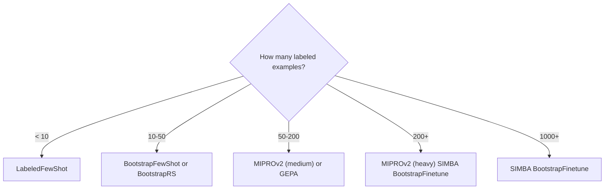

# 4.4: The Optimizer Landscape

## Introduction

DSPy doesn't give you one optimizer; it gives you an entire **toolkit**. Each optimizer takes a different approach to improving your program: some tune demonstrations, others craft instructions, some fine-tune model weights, and a few combine multiple strategies. Choosing the right one (or the right *sequence*) can mean the difference between a modest improvement and a dramatic quality leap.

This blog is your comprehensive guide to every optimizer in DSPy, when to use each, and how to combine them effectively.

---

## What You'll Learn

- Every optimizer available in DSPy and what it tunes
- A decision framework for choosing the right optimizer
- Cost and data requirements for each approach
- How to combine optimizers in sequence for maximum impact
- Rules of thumb from the DSPy documentation

---

## Prerequisites

- Completed blogs 4.1 through 4.3

---

## The Complete Optimizer Catalog

### Few-Shot Optimizers

These optimizers focus on finding the best **demonstrations** (few-shot examples) to include in prompts.

| Optimizer | Description | Data Needed |
|-----------|-------------|-------------|
| `LabeledFewShot` | Directly uses your labeled examples as demos with no bootstrapping. Simplest possible optimizer. | 5+ labeled examples |
| `BootstrapFewShot` | Runs your program to generate demos, validates with metric, keeps passing ones. | 10+ examples |
| `BootstrapFewShotWithRandomSearch` | Runs `BootstrapFewShot` multiple times with different random seeds, picks the best. | 10-50+ examples |
| `KNNFewShot` | At inference time, retrieves the most similar training examples as demos (dynamic few-shot). | 50+ examples |

```python
import dspy

# LabeledFewShot: just use your data directly
tp = dspy.LabeledFewShot(k=4)  # Pick 4 random labeled examples as demos
optimized = tp.compile(program, trainset=trainset)

# KNNFewShot: dynamic demos based on input similarity
tp = dspy.KNNFewShot(k=3, trainset=trainset)
optimized = tp.compile(program, trainset=trainset)
```

**`KNNFewShot`** is particularly interesting: instead of using the same demos for every input, it retrieves the most similar training examples *at inference time*. This means each input gets tailored demonstrations, which can significantly improve performance on diverse tasks.

### Instruction Optimizers

These optimizers focus on finding the best **instruction text** for each predictor.

| Optimizer | Description | Data Needed |
|-----------|-------------|-------------|
| `COPRO` | Generates and refines instructions through iterative coordinate ascent. | 50+ examples |
| `MIPROv2` | Jointly optimizes instructions and demos via Bayesian optimization. Auto modes for easy configuration. | 50+ examples |
| `SIMBA` | Stochastic Iterative Mini-BAtch optimization. Scales to large datasets by working on mini-batches. | 200+ examples |
| `GEPA` | Reflective prompt evolution using trajectory analysis. | 50+ examples |

```python
# COPRO: iterative instruction refinement
tp = dspy.COPRO(metric=metric, depth=3)
optimized = tp.compile(program, trainset=trainset)

# SIMBA: scales to large datasets with mini-batches
tp = dspy.SIMBA(metric=metric, max_steps=20, max_demos=4)
optimized = tp.compile(program, trainset=trainset)
```

### Fine-Tuning Optimizers

These go beyond prompt optimization to adjust the **model weights** themselves.

| Optimizer | Description | Data Needed |
|-----------|-------------|-------------|
| `BootstrapFinetune` | Bootstraps successful demonstrations, then fine-tunes a smaller model on them. Great for distillation. | 200+ examples |

```python
# BootstrapFinetune: distill from a large to a small model
tp = dspy.BootstrapFinetune(metric=metric)
optimized = tp.compile(
    program,
    trainset=trainset,
    teacher_settings=dict(lm=dspy.LM("openai/gpt-4o")),
    target="openai/gpt-4o-mini",  # Fine-tune this model
)
```

### Program Transforms

These don't tune a single program; they create **ensembles** or **combinations**.

| Optimizer | Description | Use Case |
|-----------|-------------|----------|
| `Ensemble` | Combines multiple compiled programs into one that aggregates predictions. | Robustness, variance reduction |

```python
# Ensemble: combine multiple optimized programs
programs = [optimized_v1, optimized_v2, optimized_v3]
ensemble = dspy.Ensemble(reduce_fn=dspy.majority)
combined = ensemble.compile(programs)
```

### Experimental / Advanced

| Optimizer | Description | Notes |
|-----------|-------------|-------|
| `BetterTogether` | Jointly optimizes prompts AND fine-tuning (prompt + weight optimization). | For maximum quality, requires fine-tuning access |
| `InferRules` | Infers explicit rules from training data to guide predictions. | Experimental, rule-based approach |

---

## The Decision Framework

Here's how to choose the right optimizer based on your situation:

### By Data Size



### By Goal

| Goal | Recommended Optimizer |
|------|----------------------|
| Quick baseline improvement | `BootstrapFewShotWithRandomSearch` |
| Best prompt-only optimization | `MIPROv2` (auto="medium" or "heavy") |
| Zero-shot (no demos) | `MIPROv2` with `max_bootstrapped_demos=0, max_labeled_demos=0` |
| Complex reasoning tasks | `GEPA` |
| Dynamic demos per input | `KNNFewShot` |
| Distill to smaller model | `BootstrapFinetune` |
| Maximum quality, no budget limit | `BetterTogether` |
| Robustness across inputs | `Ensemble` |

### By Budget

| Budget | Optimizer | Typical Cost |
|--------|-----------|-------------|
| Minimal (~\$0.10) | `LabeledFewShot` | Free (no LM calls for optimization) |
| Low (~\$1) | `BootstrapFewShotWithRandomSearch` | \$1-3 |
| Medium (~\$5) | `MIPROv2` auto="medium" | \$1.50-5 |
| High (~\$20) | `MIPROv2` auto="heavy" + `GEPA` | \$5-20 |
| Unlimited | `BootstrapFinetune` + `BetterTogether` | \$20+ (includes fine-tuning costs) |

---

## Combining Optimizers

One of DSPy's most powerful techniques is **optimizer stacking**, running optimizers in sequence, where each builds on the previous one's results:

```python
import dspy
from dotenv import load_dotenv

load_dotenv()

lm = dspy.LM("openai/gpt-4o-mini")
dspy.configure(lm=lm)

program = dspy.ChainOfThought("question -> answer")

def metric(example, prediction, trace=None):
    return prediction.answer.strip().lower() == example.answer.strip().lower()

# Step 1: Start with BootstrapRS for a quick baseline
tp1 = dspy.BootstrapFewShotWithRandomSearch(
    metric=metric, max_bootstrapped_demos=2,
    max_labeled_demos=2, num_candidate_programs=5,
)
step1 = tp1.compile(program, trainset=trainset)

# Step 2: Refine with MIPROv2 for better instructions
tp2 = dspy.MIPROv2(metric=metric, auto="medium", num_threads=8)
step2 = tp2.compile(step1, trainset=trainset)

# Step 3: Evaluate the improvement
evaluate = dspy.Evaluate(devset=devset, metric=metric, num_threads=4)
print(f"Baseline:  {evaluate(program)}")
print(f"Step 1:    {evaluate(step1)}")
print(f"Step 2:    {evaluate(step2)}")
```

### Stacking Strategies

| Sequence | Best For |
|----------|----------|
| BootstrapRS → MIPROv2 | General-purpose: get good demos first, then optimize instructions |
| MIPROv2 (0-shot) → MIPROv2 (few-shot) | Find great instructions first, then add matching demos |
| BootstrapRS → GEPA | Quick demos, then reflective refinement for complex tasks |
| Any optimizer → Ensemble | Create multiple candidates, then combine for robustness |

---

## General Guidance from the DSPy Docs

The DSPy documentation provides these rules of thumb:

1. **Start with `BootstrapFewShotWithRandomSearch`** as it's the fastest and cheapest way to get meaningful improvement. If you have ~10 labeled examples, start here.

2. **Graduate to `MIPROv2`** when you have 50+ examples and are willing to invest more compute. The Bayesian search over instructions + demos is strictly more powerful.

3. **Use `MIPROv2` configured for 0-shot** when you want to optimize instructions without adding demonstrations to the prompt, which is useful for latency-sensitive applications.

4. **Run `MIPROv2` with 40+ trials and 200+ examples** for production-grade optimization. This is where the Bayesian optimization really pays off.

5. **Consider `BootstrapFinetune` for distillation** when you want to transfer knowledge from a large teacher model to a smaller, cheaper student model.

6. **Always evaluate on a held-out test set** since optimizers can overfit to training data, especially with small datasets.

---

## Cost Comparison Table

| Optimizer | Setup Cost | Optimization Cost | Inference Cost Impact |
|-----------|-----------|-------------------|----------------------|
| `LabeledFewShot` | None | \$0 | Adds demo tokens |
| `BootstrapFewShot` | Minimal | \$0.50-1 | Adds demo tokens |
| `BootstrapFewShotWithRandomSearch` | Minimal | \$1-3 | Adds demo tokens |
| `KNNFewShot` | Embedding index | \$1-3 + embedding costs | Dynamic demo tokens |
| `COPRO` | Minimal | \$2-5 | Instruction tokens only |
| `MIPROv2` (light) | Minimal | \$0.50 | Instructions + demos |
| `MIPROv2` (medium) | Minimal | \$1.50 | Instructions + demos |
| `MIPROv2` (heavy) | Minimal | \$5+ | Instructions + demos |
| `GEPA` | Minimal | \$3-10 | Evolved prompt tokens |
| `SIMBA` | Minimal | \$5-15 | Instructions + demos |
| `BootstrapFinetune` | Fine-tuning setup | \$10-50+ | Lower (smaller model) |
| `BetterTogether` | Fine-tuning setup | \$20-100+ | Lower (optimized weights + prompts) |

---

## Key Takeaways

- **DSPy has optimizers for every scenario**, from zero-cost labeled few-shot to full model fine-tuning.
- **Start simple, scale up**: `BootstrapFewShotWithRandomSearch` → `MIPROv2` → `GEPA` is a natural progression.
- **Match optimizer to data size**: small data favors few-shot optimizers; large data unlocks instruction optimization and fine-tuning.
- **Combine optimizers for maximum impact** by stacking BootstrapRS + MIPROv2, which often outperforms either alone.
- **Always evaluate on held-out data** since optimization can overfit, especially with small training sets.
- **Budget wisely**: you can get 80% of the benefit for \$1-3 with BootstrapRS; the remaining 20% costs progressively more.

---

## Next Up

Time to put everything together. In the Phase 4 project, you'll build a **self-optimizing RAG pipeline**, a complete retrieval-augmented system that evaluates itself and automatically improves through optimization.

**[4.P: Project: Self-Optimizing RAG →](../4.P-project-self-optimizing-rag/blog.md)**

---

## Resources

- [DSPy Optimizers Overview](https://dspy.ai/learn/optimization/optimizers/)
- [MIPROv2 Docs](https://dspy.ai/api/optimizers/MIPROv2/)
- [BootstrapFewShot Docs](https://dspy.ai/api/optimizers/BootstrapFewShot/)
- [COPRO Docs](https://dspy.ai/api/optimizers/COPRO/)
- [GEPA Tutorial](https://dspy.ai/tutorials/gepa_ai_program/)
- [DSPy GitHub Repository](https://github.com/stanfordnlp/dspy)
