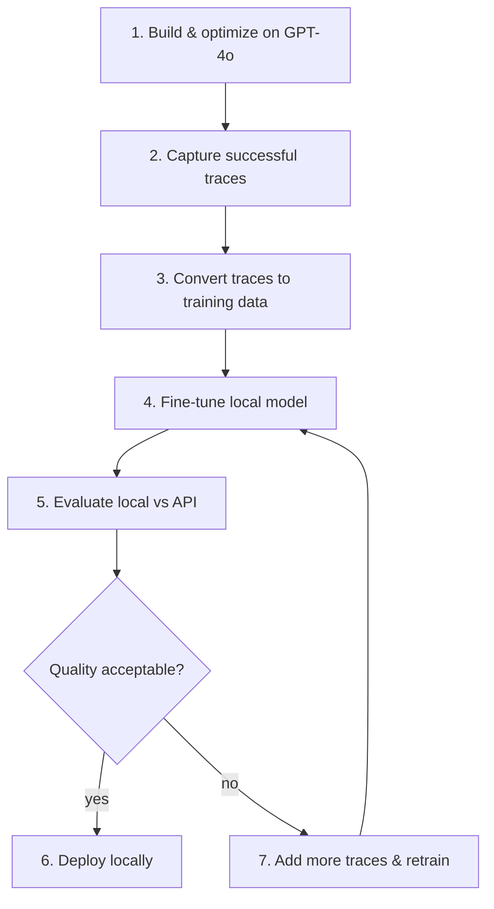

# 7.4: Local Distillation - API to Ollama

## Introduction

Phase 7's project showed you how to distill from GPT-4o to GPT-4o-mini - a cheaper API model, but still an API. You're still sending data to a third party, still paying per token, still dependent on uptime and rate limits.

This post goes further: **distilling from an expensive API model to a fully local model running on your own hardware via Ollama.** This is the endgame for teams with strict privacy requirements, fixed compute budgets, or offline deployment needs. By the end, you'll have a complete workflow for capturing traces from an optimized DSPy program and using them to fine-tune a local Llama model.

---

## What You'll Learn

- The full distillation workflow: API model to local model
- Capturing optimization traces as training data
- Setting up Ollama for local inference with DSPy
- Using `BootstrapFinetune` with local models
- Comparing API vs local: quality, latency, cost, and privacy
- A decision framework for when local distillation is worth it

---

## Prerequisites

- Completed [7.1: BootstrapFinetune](../7.1-bootstrap-finetune/blog.md) and [7.P: Distillation Project](../7.P-project-distillation/blog.md)
- [Ollama](https://ollama.com/) installed locally
- An OpenAI API key for the teacher model
- At least 8GB VRAM (16GB recommended) for local fine-tuning

---

## The Distillation Pipeline

Here is the full workflow, from API to local:



---

## Step 1: Build and Optimize on GPT-4o

Start with the best model. Get your pipeline working perfectly before distilling:

```python
import dspy

# Teacher: powerful API model
teacher_lm = dspy.LM("openai/gpt-4o")
dspy.configure(lm=teacher_lm)


class TechnicalQA(dspy.Signature):
    """Answer technical programming questions with clear, accurate explanations."""

    question: str = dspy.InputField()
    answer: str = dspy.OutputField(desc="Clear, concise technical explanation")


# Build the program
qa_program = dspy.ChainOfThought(TechnicalQA)

# Training data
trainset = [
    dspy.Example(
        question="What is a race condition?",
        answer="A race condition occurs when two or more threads access shared data concurrently, and the outcome depends on the order of execution. This leads to unpredictable behavior because the threads 'race' to read/write the data.",
    ).with_inputs("question"),
    dspy.Example(
        question="Explain the difference between processes and threads.",
        answer="Processes are independent execution units with their own memory space. Threads are lighter-weight units within a process that share the same memory. Threads are faster to create but require synchronization to avoid data corruption.",
    ).with_inputs("question"),
    # ... more examples
]

devset = [
    dspy.Example(
        question="What is deadlock?",
        answer="Deadlock occurs when two or more threads are each waiting for the other to release a resource, creating a circular dependency where none can proceed.",
    ).with_inputs("question"),
    # ... more examples
]

# Optimize the teacher program first
optimizer = dspy.MIPROv2(metric=lambda ex, pred, trace=None: dspy.evaluate.SemanticF1()(ex, pred, trace), auto="medium")
optimized_teacher = optimizer.compile(qa_program, trainset=trainset)

# Save the optimized teacher
optimized_teacher.save("optimized_teacher", save_program=True)
print("Teacher optimized and saved.")
```

---

## Step 2: Set Up Ollama for Local Inference

Before distillation, verify your local model works with DSPy:

```bash
# Pull a model suitable for fine-tuning
ollama pull llama3.2

# Verify it's running
ollama list
```

```python
# Test local model with DSPy
local_lm = dspy.LM(
    "ollama_chat/llama3.2",
    api_base="http://localhost:11434",
)

# Quick sanity check
with dspy.context(lm=local_lm):
    result = qa_program(question="What is a hash map?")
    print(f"Local model answer: {result.answer}")
```

If this works, your local model is ready for the pipeline.

---

## Step 3: Capture Traces as Training Data

The key insight of `BootstrapFinetune` is that it runs your optimized program on training examples, captures the successful traces (the exact prompts and completions), and converts them into fine-tuning data:

```python
# Load the optimized teacher
from dspy import Predict

optimized_teacher = Predict(TechnicalQA)
optimized_teacher.load("optimized_teacher")

# BootstrapFinetune captures traces automatically
# It runs the teacher on trainset, keeps traces where the metric passes,
# and packages them as fine-tuning data

distillation_optimizer = dspy.BootstrapFinetune(
    metric=lambda ex, pred, trace=None: dspy.evaluate.SemanticF1()(ex, pred, trace),
)
```

---

## Step 4: Distill to the Local Model

Now point `BootstrapFinetune` at the local model:

```python
# Configure the student (local) model
student_lm = dspy.LM(
    "ollama_chat/llama3.2",
    api_base="http://localhost:11434",
)
dspy.configure(lm=student_lm)

# Compile: runs teacher traces, fine-tunes the local model
distilled = distillation_optimizer.compile(
    optimized_teacher,
    trainset=trainset,
)

print("Distillation complete!")
```

**What happens during `.compile()`:**

1. The teacher program runs on every training example
2. Successful traces (where the metric passes) are collected
3. Traces are converted to prompt-completion pairs
4. The local model is fine-tuned on these pairs
5. The distilled program is returned with the fine-tuned model

---

## Step 5: Evaluate Local vs API

Compare the two head-to-head:

```python
from dspy.evaluate import Evaluate

# Evaluation metric
def qa_metric(example, prediction, trace=None):
    return dspy.evaluate.SemanticF1()(example, prediction, trace)

evaluator = Evaluate(devset=devset, metric=qa_metric, num_threads=4)

# Evaluate teacher (API model)
dspy.configure(lm=teacher_lm)
teacher_score = evaluator(optimized_teacher)

# Evaluate student (local model)
dspy.configure(lm=student_lm)
student_score = evaluator(distilled)

print(f"Teacher (GPT-4o):         {teacher_score:.1f}%")
print(f"Student (Llama local):    {student_score:.1f}%")
print(f"Quality retention:        {student_score/teacher_score*100:.0f}%")
```

### Interpreting Results

| Quality Retention | What It Means | Next Step |
|-------------------|--------------|-----------|
| 90-100% | Excellent distillation | Deploy the local model |
| 75-90% | Good for most use cases | Acceptable for many production scenarios |
| 50-75% | Significant quality drop | Add more training data and re-distill |
| Below 50% | Task too complex for the student | Use a larger local model or hybrid approach |

---

## Step 6: Cost and Latency Comparison

Build a practical comparison:

```python
import time


def benchmark(program, questions, lm):
    """Benchmark a program on a set of questions."""
    dspy.configure(lm=lm)

    latencies = []
    for q in questions:
        start = time.perf_counter()
        program(question=q)
        latencies.append(time.perf_counter() - start)

    return {
        "avg_latency_ms": sum(latencies) / len(latencies) * 1000,
        "p95_latency_ms": sorted(latencies)[int(len(latencies) * 0.95)] * 1000,
    }


test_questions = [ex.question for ex in devset[:20]]

api_bench = benchmark(optimized_teacher, test_questions, teacher_lm)
local_bench = benchmark(distilled, test_questions, student_lm)

print(f"{'Metric':<25} {'API (GPT-4o)':<20} {'Local (Llama)':<20}")
print("-" * 65)
print(f"{'Avg latency':<25} {api_bench['avg_latency_ms']:<20.0f} {local_bench['avg_latency_ms']:<20.0f}")
print(f"{'P95 latency':<25} {api_bench['p95_latency_ms']:<20.0f} {local_bench['p95_latency_ms']:<20.0f}")
print(f"{'Cost per 1K calls':<25} {'~$2.50':<20} {'$0.00':<20}")
print(f"{'Data leaves machine':<25} {'Yes':<20} {'No':<20}")
print(f"{'Offline capable':<25} {'No':<20} {'Yes':<20}")
```

---

## Decision Framework: When to Distill Locally

Local distillation is worth it when:

| Factor | Distill Locally | Stay on API |
|--------|----------------|-------------|
| **Privacy** | Sensitive data (medical, legal, PII) | Public data, no compliance concerns |
| **Cost** | High volume (>100K calls/month) | Low volume, API costs manageable |
| **Latency** | Need <50ms responses | 200-500ms is acceptable |
| **Offline** | Edge deployment, air-gapped systems | Always-online environment |
| **Task complexity** | Classification, extraction, simple QA | Complex reasoning, multi-step analysis |
| **Model quality gap** | <15% quality drop is acceptable | Need maximum quality at all costs |

### The Hybrid Pattern

For many production systems, the best approach combines both:

```python
class HybridQA(dspy.Module):
    """Use local model normally, fall back to API for hard cases."""

    def __init__(self):
        self.local_qa = dspy.ChainOfThought(TechnicalQA)
        self.api_qa = dspy.ChainOfThought(TechnicalQA)
        self.confidence = dspy.Predict("question, answer -> is_confident: bool")

    def forward(self, question: str):
        # Try local model first
        with dspy.context(lm=dspy.LM("ollama_chat/llama3.2", api_base="http://localhost:11434")):
            local_result = self.local_qa(question=question)
            confidence = self.confidence(
                question=question, answer=local_result.answer
            )

        if confidence.is_confident:
            return local_result

        # Fall back to API for uncertain answers
        with dspy.context(lm=dspy.LM("openai/gpt-4o")):
            return self.api_qa(question=question)
```

This gives you local speed and privacy for 80-90% of queries, with API-quality fallback for edge cases.

---

## Key Takeaways

- **Start with the best, then distill.** Optimize on GPT-4o first. Distill to a local model second. Never optimize on the weak model directly.
- **`BootstrapFinetune` handles the heavy lifting.** It captures traces from the teacher, filters by your metric, and fine-tunes the student automatically.
- **Expect 75-95% quality retention.** For most structured tasks (QA, classification, extraction), local models retain most of the teacher's quality.
- **The hybrid approach is often best.** Local model for routine queries, API fallback for the hard ones. This cuts costs by 80-90% while maintaining peak quality.
- **Always evaluate on held-out data.** The distilled model must prove itself on examples it never trained on.

---

## Next Up

You've now completed the finetuning toolkit: `BootstrapFinetune` for distillation, `BetterTogether` for joint optimization, `Ensemble` for combining programs, the full distillation project, and now local distillation. Next, we explore processing contexts far larger than any model's window.

**[Phase 8: RLM - Recursive Language Models →](../../08-rlm/8.1-understanding-rlm/blog.md)**

---

## Resources

- [Ollama Documentation](https://ollama.com/)
- [DSPy BootstrapFinetune API](https://dspy.ai/api/optimizers/BootstrapFinetune/)
- [Llama 3.2 Model Card](https://ollama.com/library/llama3.2)
- [Code examples for this post](code/)
