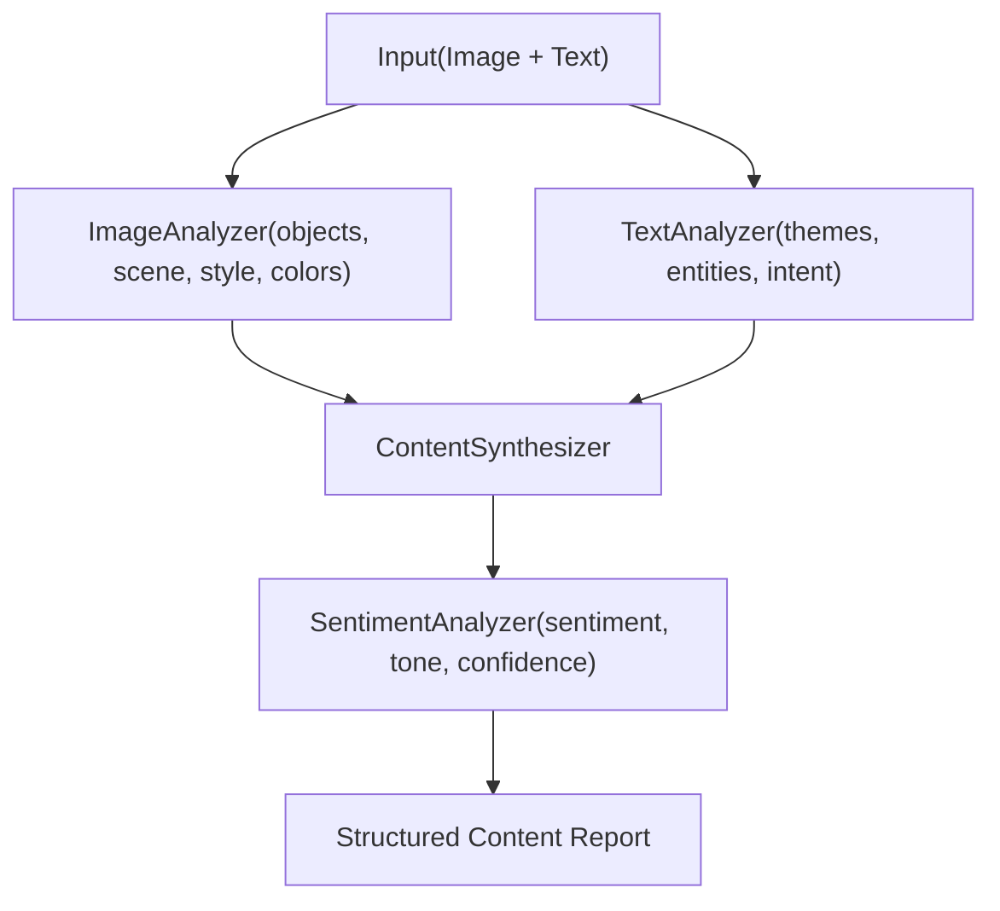

# 10.P: Project: Multi-Modal Content Analyzer

## Introduction

You've learned to work with images and audio individually, and you've built pipelines that combine modalities. Now it's time to bring everything together into a production-grade system: a **Multi-Modal Content Analyzer** that accepts images and text, produces structured analysis across multiple dimensions, and is optimized end-to-end with DSPy.

This project simulates a real-world use case you'd find at a social media company, a marketing agency, or a content moderation platform. Given a piece of visual content (an image) and its accompanying text (a caption, product description, or social media post), the system performs visual analysis, text analysis, cross-modal synthesis, and sentiment analysis, producing a comprehensive, structured content report.

---

## What You'll Build

1. **ImageAnalyzer** uses `dspy.Image` to analyze visual content (objects, scene, colors, style)
2. **TextAnalyzer** extracts key themes, entities, and intent from accompanying text
3. **ContentSynthesizer** combines visual and text analysis into a unified understanding
4. **SentimentAnalyzer** determines overall sentiment and emotional tone across modalities
5. **ContentAnalysisPipeline** orchestrates all four components into a single module
6. **Evaluation harness** with custom metrics for multi-dimensional content analysis
7. **MIPROv2 optimization** for automatic improvement of the full pipeline

---

## Prerequisites

- Completed [10.1: Working with Images and Audio](../10.1-image-audio/blog.md) and [10.2: Building Multi-Modal Pipelines](../10.2-multi-modal-pipelines/blog.md)
- Familiarity with DSPy evaluation ([Blog 3.3](../../03-evaluation/3.3-running-evaluations/blog.md)) and optimization ([Blog 4.2](../../04-optimization/4.2-miprov2/blog.md))
- `uv add dspy python-dotenv` installed
- OpenAI API key with `gpt-4o-mini` access

---

## Architecture Overview

The system follows a four-stage pipeline:



Each component is a `dspy.Module` with its own signature. The pipeline module orchestrates them and returns a comprehensive `dspy.Prediction`.

---

## Step 1: Define the Signatures

Each analysis stage needs a clear signature. Let's define them all:

```python
import dspy
from dotenv import load_dotenv

load_dotenv()

lm = dspy.LM("openai/gpt-4o-mini")
dspy.configure(lm=lm)


# --- Signature 1: Image Analysis ---
class ImageAnalysisSignature(dspy.Signature):
    """Analyze the visual content of an image, identifying objects, scene,
    artistic style, and dominant colors."""

    image: dspy.Image = dspy.InputField()
    objects: list[str] = dspy.OutputField(desc="objects and subjects detected in the image")
    scene_description: str = dspy.OutputField(desc="description of the scene or setting")
    visual_style: str = dspy.OutputField(
        desc="photographic or artistic style (e.g., 'professional product photo', "
        "'candid street photography', 'digital illustration')"
    )
    dominant_colors: list[str] = dspy.OutputField(desc="3-5 dominant colors in the image")


# --- Signature 2: Text Analysis ---
class TextAnalysisSignature(dspy.Signature):
    """Analyze accompanying text to extract themes, entities, and communicative intent."""

    text: str = dspy.InputField(desc="the accompanying text (caption, description, etc.)")
    key_themes: list[str] = dspy.OutputField(desc="main themes or topics in the text")
    entities: list[str] = dspy.OutputField(desc="named entities (people, brands, places)")
    intent: str = dspy.OutputField(
        desc="communicative intent (e.g., 'promotional', 'informational', "
        "'personal sharing', 'call to action')"
    )
    tone: str = dspy.OutputField(desc="writing tone (e.g., 'casual', 'professional', 'humorous')")


# --- Signature 3: Content Synthesis ---
class ContentSynthesisSignature(dspy.Signature):
    """Combine visual and text analyses into a unified content understanding."""

    scene_description: str = dspy.InputField()
    objects: list[str] = dspy.InputField()
    visual_style: str = dspy.InputField()
    dominant_colors: list[str] = dspy.InputField()
    key_themes: list[str] = dspy.InputField()
    entities: list[str] = dspy.InputField()
    intent: str = dspy.InputField()
    text_tone: str = dspy.InputField()
    coherence_assessment: str = dspy.OutputField(
        desc="how well the image and text complement each other"
    )
    unified_summary: str = dspy.OutputField(
        desc="2-3 sentence summary integrating visual and textual content"
    )
    content_category: str = dspy.OutputField(
        desc="category (e.g., 'product marketing', 'lifestyle', 'news', 'entertainment')"
    )
    target_audience: str = dspy.OutputField(desc="likely target audience for this content")


# --- Signature 4: Sentiment Analysis ---
class SentimentSignature(dspy.Signature):
    """Determine overall sentiment and emotional tone from a unified content summary."""

    unified_summary: str = dspy.InputField()
    coherence_assessment: str = dspy.InputField()
    content_category: str = dspy.InputField()
    sentiment: str = dspy.OutputField(
        desc="overall sentiment: 'positive', 'negative', 'neutral', or 'mixed'"
    )
    emotional_tone: str = dspy.OutputField(
        desc="specific emotional tone (e.g., 'aspirational', 'urgent', 'nostalgic', 'playful')"
    )
    confidence: float = dspy.OutputField(desc="confidence score from 0.0 to 1.0")
```

---

## Step 2: Build the Component Modules

Each module wraps a signature with an appropriate reasoning strategy:

```python
class ImageAnalyzer(dspy.Module):
    """Analyze visual content from an image."""

    def __init__(self):
        self.analyze = dspy.ChainOfThought(ImageAnalysisSignature)

    def forward(self, image: dspy.Image):
        return self.analyze(image=image)


class TextAnalyzer(dspy.Module):
    """Extract themes, entities, and intent from text."""

    def __init__(self):
        self.analyze = dspy.ChainOfThought(TextAnalysisSignature)

    def forward(self, text: str):
        return self.analyze(text=text)


class ContentSynthesizer(dspy.Module):
    """Combine visual and text analysis into unified understanding."""

    def __init__(self):
        self.synthesize = dspy.ChainOfThought(ContentSynthesisSignature)

    def forward(self, visual_result, text_result):
        return self.synthesize(
            scene_description=visual_result.scene_description,
            objects=visual_result.objects,
            visual_style=visual_result.visual_style,
            dominant_colors=visual_result.dominant_colors,
            key_themes=text_result.key_themes,
            entities=text_result.entities,
            intent=text_result.intent,
            text_tone=text_result.tone,
        )


class SentimentAnalyzer(dspy.Module):
    """Determine overall sentiment and emotional tone."""

    def __init__(self):
        self.analyze = dspy.ChainOfThought(SentimentSignature)

    def forward(self, synthesis_result):
        return self.analyze(
            unified_summary=synthesis_result.unified_summary,
            coherence_assessment=synthesis_result.coherence_assessment,
            content_category=synthesis_result.content_category,
        )
```

---

## Step 3: Orchestrate the Pipeline

The main pipeline module wires everything together:

```python
class ContentAnalysisPipeline(dspy.Module):
    """Full multi-modal content analysis: image + text -> structured report."""

    def __init__(self):
        self.image_analyzer = ImageAnalyzer()
        self.text_analyzer = TextAnalyzer()
        self.synthesizer = ContentSynthesizer()
        self.sentiment_analyzer = SentimentAnalyzer()

    def forward(self, image: dspy.Image, text: str):
        # Stage 1 and 2: Parallel analysis (conceptually; DSPy runs sequentially)
        visual_result = self.image_analyzer(image=image)
        text_result = self.text_analyzer(text=text)

        # Stage 3: Synthesize cross-modal understanding
        synthesis = self.synthesizer(visual_result, text_result)

        # Stage 4: Sentiment analysis on unified content
        sentiment = self.sentiment_analyzer(synthesis)

        # Return comprehensive report
        return dspy.Prediction(
            # Visual analysis
            objects=visual_result.objects,
            scene_description=visual_result.scene_description,
            visual_style=visual_result.visual_style,
            dominant_colors=visual_result.dominant_colors,
            # Text analysis
            key_themes=text_result.key_themes,
            entities=text_result.entities,
            intent=text_result.intent,
            text_tone=text_result.tone,
            # Synthesis
            coherence_assessment=synthesis.coherence_assessment,
            unified_summary=synthesis.unified_summary,
            content_category=synthesis.content_category,
            target_audience=synthesis.target_audience,
            # Sentiment
            sentiment=sentiment.sentiment,
            emotional_tone=sentiment.emotional_tone,
            confidence=sentiment.confidence,
        )
```

### Testing the Pipeline

```python
pipeline = ContentAnalysisPipeline()

# Social media post analysis
result = pipeline(
    image=dspy.Image.from_url(
        "https://upload.wikimedia.org/wikipedia/commons/thumb/3/3a/Cat03.jpg/1200px-Cat03.jpg"
    ),
    text="Just adopted this beautiful furball! Meet Luna, the newest member of our family. #adoptdontshop #catlover",
)

print("=" * 60)
print("MULTI-MODAL CONTENT ANALYSIS REPORT")
print("=" * 60)
print(f"\nVisual Analysis:")
print(f"  Objects: {result.objects}")
print(f"  Scene: {result.scene_description}")
print(f"  Style: {result.visual_style}")
print(f"  Colors: {result.dominant_colors}")
print(f"\nText Analysis:")
print(f"  Themes: {result.key_themes}")
print(f"  Entities: {result.entities}")
print(f"  Intent: {result.intent}")
print(f"  Tone: {result.text_tone}")
print(f"\nSynthesis:")
print(f"  Category: {result.content_category}")
print(f"  Audience: {result.target_audience}")
print(f"  Coherence: {result.coherence_assessment}")
print(f"  Summary: {result.unified_summary}")
print(f"\nSentiment:")
print(f"  Sentiment: {result.sentiment}")
print(f"  Emotional Tone: {result.emotional_tone}")
print(f"  Confidence: {result.confidence}")
```

---

## Step 4: Build the Evaluation Set

For optimization, you need labeled examples. Each example includes an image, text, and expected analysis outputs:

```python
def make_example(image_url, text, content_category, sentiment, intent):
    """Helper to create evaluation examples."""
    return dspy.Example(
        image=dspy.Image.from_url(image_url),
        text=text,
        content_category=content_category,
        sentiment=sentiment,
        intent=intent,
    ).with_inputs("image", "text")


# Training examples: social media and product content
trainset = [
    make_example(
        "https://upload.wikimedia.org/wikipedia/commons/thumb/6/6d/Good_Food_Display_-_NCI_Visuals_Online.jpg/800px-Good_Food_Display_-_NCI_Visuals_Online.jpg",
        "Fresh organic produce delivered to your door every week! Use code FRESH20 for 20% off your first order.",
        "product marketing",
        "positive",
        "promotional",
    ),
    make_example(
        "https://upload.wikimedia.org/wikipedia/commons/thumb/3/3a/Cat03.jpg/1200px-Cat03.jpg",
        "After months of searching, we finally found our perfect companion. Adoption day was the best day!",
        "lifestyle",
        "positive",
        "personal sharing",
    ),
    make_example(
        "https://upload.wikimedia.org/wikipedia/commons/thumb/e/ea/Van_Gogh_-_Starry_Night_-_Google_Art_Project.jpg/1280px-Van_Gogh_-_Starry_Night_-_Google_Art_Project.jpg",
        "Van Gogh's Starry Night (1889) remains one of the most recognized paintings in Western art. "
        "Currently housed at the Museum of Modern Art in New York.",
        "entertainment",
        "neutral",
        "informational",
    ),
    make_example(
        "https://upload.wikimedia.org/wikipedia/commons/thumb/1/1a/24701-nature-702702.jpg/1280px-24701-nature-702702.jpg",
        "This weekend's hiking trail was absolutely breathtaking. Nature always reminds me what matters most.",
        "lifestyle",
        "positive",
        "personal sharing",
    ),
    make_example(
        "https://upload.wikimedia.org/wikipedia/commons/thumb/b/b6/Image_created_with_a_mobile_phone.png/1200px-Image_created_with_a_mobile_phone.png",
        "New smartphone camera comparison: 2025 flagships deliver stunning low-light performance. Full review in the link.",
        "product marketing",
        "positive",
        "informational",
    ),
]

# Dev/test examples
devset = [
    make_example(
        "https://upload.wikimedia.org/wikipedia/commons/thumb/4/47/PNG_transparency_demonstration_1.png/280px-PNG_transparency_demonstration_1.png",
        "Transparency in design isn't just about aesthetics. It's about building trust with your audience.",
        "informational",
        "neutral",
        "informational",
    ),
    make_example(
        "https://upload.wikimedia.org/wikipedia/commons/thumb/a/a7/Camponotus_flavomarginatus_ant.jpg/1024px-Camponotus_flavomarginatus_ant.jpg",
        "Close-up macro photography reveals worlds invisible to the naked eye. Every creature is a masterpiece.",
        "entertainment",
        "positive",
        "personal sharing",
    ),
]
```

---

## Step 5: Define Custom Metrics

Multi-modal analysis needs multi-dimensional evaluation. We'll evaluate three key fields and combine them:

```python
def content_analysis_metric(example, prediction, trace=None):
    """Multi-dimensional metric for content analysis quality.

    Evaluates:
    - content_category accuracy (exact match)
    - sentiment accuracy (exact match)
    - intent accuracy (exact match)

    Returns a score from 0.0 to 1.0.
    """
    scores = []

    # 1. Content category accuracy
    if hasattr(prediction, "content_category") and hasattr(example, "content_category"):
        pred_cat = prediction.content_category.lower().strip()
        gold_cat = example.content_category.lower().strip()
        scores.append(1.0 if pred_cat == gold_cat else 0.0)

    # 2. Sentiment accuracy
    if hasattr(prediction, "sentiment") and hasattr(example, "sentiment"):
        pred_sent = prediction.sentiment.lower().strip()
        gold_sent = example.sentiment.lower().strip()
        scores.append(1.0 if pred_sent == gold_sent else 0.0)

    # 3. Intent accuracy
    if hasattr(prediction, "intent") and hasattr(example, "intent"):
        pred_intent = prediction.intent.lower().strip()
        gold_intent = example.intent.lower().strip()
        scores.append(1.0 if pred_intent == gold_intent else 0.0)

    return sum(scores) / len(scores) if scores else 0.0
```

For more nuanced evaluation, you can add an LLM-as-judge component for the `unified_summary` field:

```python
class SummaryQualityJudge(dspy.Signature):
    """Judge the quality of a multi-modal content summary."""

    unified_summary: str = dspy.InputField()
    content_category: str = dspy.InputField()
    expected_category: str = dspy.InputField()
    quality_score: float = dspy.OutputField(desc="quality from 0.0 to 1.0")


judge = dspy.Predict(SummaryQualityJudge)


def enhanced_metric(example, prediction, trace=None):
    """Combines exact-match fields with LLM-judged summary quality."""
    base_score = content_analysis_metric(example, prediction, trace)

    # LLM judge for summary quality (only when not tracing for optimization)
    if trace is None and hasattr(prediction, "unified_summary"):
        judge_result = judge(
            unified_summary=prediction.unified_summary,
            content_category=prediction.content_category,
            expected_category=example.content_category,
        )
        summary_score = float(judge_result.quality_score)
        return 0.7 * base_score + 0.3 * summary_score

    return base_score
```

---

## Step 6: Evaluate the Baseline

```python
# Evaluate baseline performance
evaluate = dspy.Evaluate(
    devset=devset,
    metric=content_analysis_metric,
    num_threads=4,
    display_progress=True,
)

pipeline = ContentAnalysisPipeline()
baseline_score = evaluate(pipeline)
print(f"Baseline score: {baseline_score:.1f}%")
```

---

## Step 7: Optimize with MIPROv2

Now we optimize the entire four-module pipeline. `MIPROv2` will discover better instructions for each of the four `ChainOfThought` modules:

```python
optimizer = dspy.MIPROv2(
    metric=content_analysis_metric,
    auto="light",
    num_threads=4,
)

optimized_pipeline = optimizer.compile(
    ContentAnalysisPipeline(),
    trainset=trainset,
    max_bootstrapped_demos=2,
    max_labeled_demos=2,
)

# Evaluate optimized pipeline
optimized_score = evaluate(optimized_pipeline)
print(f"Optimized score: {optimized_score:.1f}%")
print(f"Improvement: {optimized_score - baseline_score:+.1f}%")
```

The optimizer will generate and test different instruction candidates for each module. The image analyzer, text analyzer, synthesizer, and sentiment analyzer all get independently improved prompts.

### Saving the Optimized Pipeline

```python
# Save for later use
optimized_pipeline.save("optimized_content_analyzer")

# Load it back
loaded_pipeline = ContentAnalysisPipeline()
loaded_pipeline.load("optimized_content_analyzer")
```

---

## Example Use Cases

### Social Media Post Analysis

```python
result = optimized_pipeline(
    image=dspy.Image.from_url("https://example.com/instagram-post.jpg"),
    text="Living my best life in Bali! The sunsets here are unreal. #travel #bali #wanderlust",
)
# Expected: lifestyle, positive sentiment, personal sharing intent
```

### Product Review Analysis

```python
result = optimized_pipeline(
    image=dspy.Image.from_url("https://example.com/product-review.jpg"),
    text="I've been using this standing desk for 3 months. Build quality is excellent but "
    "the motor could be quieter. 4/5 stars.",
)
# Expected: product marketing, mixed sentiment, informational intent
```

### News Content Analysis

```python
result = optimized_pipeline(
    image=dspy.Image.from_url("https://example.com/news-photo.jpg"),
    text="City council approved the new park renovation plan Tuesday, allocating \$2.5M "
    "for green infrastructure improvements in the downtown corridor.",
)
# Expected: news, neutral sentiment, informational intent
```

---

## Production Considerations

### Rate Limiting and Costs

Each pipeline call makes **four LM calls** (one per module). With images in the mix, each call costs more than a text-only call. For production:

```python
# Use gpt-4o-mini for cost efficiency (strong vision capabilities at lower cost)
lm = dspy.LM("openai/gpt-4o-mini", max_tokens=1000)
dspy.configure(lm=lm)
```

### Batch Processing

For analyzing large content libraries, process in batches with error handling:

```python
import time


def analyze_batch(pipeline, items, delay=0.5):
    """Process content items in batch with rate-limiting."""
    results = []
    for i, item in enumerate(items):
        try:
            result = pipeline(image=item["image"], text=item["text"])
            results.append({"status": "success", "result": result, "index": i})
        except Exception as e:
            results.append({"status": "error", "error": str(e), "index": i})
        time.sleep(delay)  # rate-limit
    return results
```

### Caching Strategy

For production systems that re-analyze the same content:

```python
# DSPy caching handles repeated identical inputs
# For content that changes (e.g., updated captions), use cache=False selectively
lm_nocache = dspy.LM("openai/gpt-4o-mini", cache=False)

with dspy.context(lm=lm_nocache):
    fresh_result = pipeline(image=image, text=updated_text)
```

### Error Handling

Multi-modal pipelines can fail if images are unavailable or models reject content:

```python
class RobustContentAnalysisPipeline(ContentAnalysisPipeline):
    """Production-hardened version with fallback handling."""

    def forward(self, image: dspy.Image, text: str):
        try:
            return super().forward(image=image, text=text)
        except Exception as e:
            # Fall back to text-only analysis
            text_result = self.text_analyzer(text=text)
            return dspy.Prediction(
                objects=[],
                scene_description="Image analysis unavailable",
                visual_style="unknown",
                dominant_colors=[],
                key_themes=text_result.key_themes,
                entities=text_result.entities,
                intent=text_result.intent,
                text_tone=text_result.tone,
                coherence_assessment="Image unavailable, text-only analysis",
                unified_summary=f"Text analysis: {', '.join(text_result.key_themes)}",
                content_category="unknown",
                target_audience="general",
                sentiment="neutral",
                emotional_tone="neutral",
                confidence=0.5,
            )
```

---

## Key Takeaways

- **Modular architecture:** four specialized modules are independently optimizable.
- **Typed signatures:** `dspy.Image` fields work exactly like `str` fields in signatures.
- **Custom metrics:** combine exact-match evaluation with LLM-as-judge for richer signals.
- **MIPROv2 optimizes the full pipeline.** Each module gets independently improved instructions.
- **Production hardening:** add fallbacks, batch processing, and caching for real workloads.
- **Cost management:** vision tokens are expensive; use `gpt-4o-mini` and limit few-shot demos.

---

## Next Up

You've built a complete multi-modal content analyzer, combining vision and text analysis with structured outputs, evaluation, and optimization. In Phase 11, you'll take everything you've built across this series and make it **production-ready**: caching, async streaming, deployment, and observability.

[Phase 11: Production Engineering](../../11-production/11.1-caching-performance/blog.md)

---

## Resources

- [DSPy Multi-Modality Guide](https://dspy.ai/learn/programming/multi_modality/)
- [DSPy Image API Reference](https://dspy.ai/api/primitives/Image/)
- [DSPy Evaluation Guide](https://dspy.ai/learn/evaluation/overview/)
- [DSPy MIPROv2 Optimizer](https://dspy.ai/api/optimizers/MIPROv2/)
- [Image Generation Prompting Tutorial](https://dspy.ai/tutorials/image_generation_prompting/)
- [DSPy GitHub Repository](https://github.com/stanfordnlp/dspy)
- [Blog 10.1: Working with Images and Audio](../10.1-image-audio/blog.md)
- [Blog 10.2: Building Multi-Modal Pipelines](../10.2-multi-modal-pipelines/blog.md)
- [Blog 4.2: MIPROv2](../../04-optimization/4.2-miprov2/blog.md)
