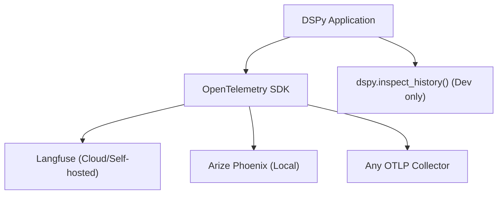

# 11.5: Production Tracing with Langfuse, Phoenix, and OpenTelemetry

## Introduction

In [11.4: Debugging and Observability](../11.4-debugging-observability/blog.md), you learned DSPy's built-in tools: `inspect_history()`, logging, and usage tracking. These are excellent for development. But production demands more: **you need persistent trace storage, visual dashboards, cost attribution, and alerting** across hundreds or thousands of daily requests.

This post covers integrating DSPy with three dedicated observability platforms: **OpenTelemetry** (the open standard), **Langfuse** (open-source LLM tracing), and **Arize Phoenix** (local observability dashboard). By the end, you'll know how to visually trace every module execution, retrieved document, and token consumed in your deployed DSPy programs.

---

## What You'll Learn

- OpenTelemetry SDK setup for DSPy trace collection
- Langfuse integration: tracing compiled programs and viewing prompt evolution
- Arize Phoenix: local observability dashboard for DSPy
- Custom span creation for multi-stage pipelines
- Tracking optimization history and compilation states
- Dashboard patterns: cost tracking, latency percentiles, error rates
- Comparison: Langfuse vs Phoenix vs MLflow vs custom solutions

---

## Prerequisites

- Completed [11.4: Debugging and Observability](../11.4-debugging-observability/blog.md)
- A deployed DSPy application (or the production API from [11.P](../11.P-project-production-api/blog.md))

---

## The Observability Stack

Here's how these tools fit together:



**OpenTelemetry** is the foundation - an open standard for collecting traces and metrics. **Langfuse** and **Phoenix** are backends that store and visualize those traces. You can use either or both.

---

## Option 1: Langfuse - Open-Source LLM Tracing

Langfuse is purpose-built for LLM observability. It captures prompts, completions, token counts, latencies, and costs - exactly what you need for DSPy.

### Setup

```bash
uv add langfuse opentelemetry-sdk opentelemetry-exporter-otlp
```

### Configuration

```python
import os
from langfuse import Langfuse

# Initialize Langfuse (get keys from https://langfuse.com)
os.environ["LANGFUSE_PUBLIC_KEY"] = "pk-..."
os.environ["LANGFUSE_SECRET_KEY"] = "sk-..."
os.environ["LANGFUSE_HOST"] = "https://cloud.langfuse.com"  # or self-hosted URL

langfuse = Langfuse()
```

### Tracing a DSPy Program

Wrap your DSPy calls in Langfuse traces to capture the full execution:

```python
import dspy

lm = dspy.LM("openai/gpt-4o-mini")
dspy.configure(lm=lm)

qa = dspy.ChainOfThought("question -> answer")


def traced_predict(question: str):
    """Run a DSPy prediction with Langfuse tracing."""
    # Create a trace for this request
    trace = langfuse.trace(
        name="qa-prediction",
        metadata={"model": "gpt-4o-mini", "program": "ChainOfThought"},
    )

    # Create a span for the DSPy module execution
    span = trace.span(
        name="chain-of-thought",
        input={"question": question},
    )

    try:
        result = qa(question=question)

        span.end(
            output={"answer": result.answer},
            metadata={"reasoning": result.rationale if hasattr(result, "rationale") else ""},
        )

        # Log the LM call details from DSPy history
        history = lm.history
        if history:
            last_call = history[-1]
            trace.generation(
                name="lm-call",
                model="gpt-4o-mini",
                input=last_call.get("prompt", ""),
                output=last_call.get("response", ""),
                usage={
                    "input": last_call.get("usage", {}).get("prompt_tokens", 0),
                    "output": last_call.get("usage", {}).get("completion_tokens", 0),
                },
            )

        trace.update(output={"answer": result.answer})
        return result

    except Exception as e:
        span.end(level="ERROR", status_message=str(e))
        raise
    finally:
        langfuse.flush()


# Usage
result = traced_predict("What is the CAP theorem?")
print(result.answer)
# View trace at https://cloud.langfuse.com
```

### Tracing Multi-Stage Pipelines

For complex pipelines, create nested spans:

```python
class TracedResearchPipeline(dspy.Module):
    """Research pipeline with Langfuse tracing at every stage."""

    def __init__(self):
        self.retrieve = dspy.Retrieve(k=5)
        self.analyze = dspy.ChainOfThought(
            "question, passages -> analysis: str"
        )
        self.synthesize = dspy.ChainOfThought(
            "question, analysis -> answer: str, confidence: float"
        )

    def forward(self, question: str):
        trace = langfuse.trace(
            name="research-pipeline",
            input={"question": question},
        )

        # Stage 1: Retrieve
        retrieve_span = trace.span(name="retrieve", input={"question": question})
        passages = self.retrieve(question).passages
        retrieve_span.end(output={"num_passages": len(passages)})

        # Stage 2: Analyze
        analyze_span = trace.span(name="analyze", input={"passages_count": len(passages)})
        analysis = self.analyze(question=question, passages=passages)
        analyze_span.end(output={"analysis_length": len(analysis.analysis)})

        # Stage 3: Synthesize
        synth_span = trace.span(name="synthesize", input={"has_analysis": True})
        result = self.synthesize(question=question, analysis=analysis.analysis)
        synth_span.end(output={
            "answer": result.answer[:100],
            "confidence": result.confidence,
        })

        trace.update(output={"answer": result.answer, "confidence": result.confidence})
        langfuse.flush()

        return result
```

---

## Option 2: Arize Phoenix - Local Observability

Phoenix runs entirely locally - no cloud account needed. It's excellent for development and for teams that can't send data externally.

### Setup

```bash
uv add arize-phoenix opentelemetry-sdk opentelemetry-exporter-otlp
```

### Launch the Dashboard

```python
import phoenix as px

# Start Phoenix in the background
session = px.launch_app()
print(f"Phoenix dashboard: {session.url}")  # http://localhost:6006
```

### Instrument DSPy with OpenTelemetry

Phoenix uses OpenTelemetry as its collection mechanism:

```python
from opentelemetry import trace
from opentelemetry.sdk.trace import TracerProvider
from opentelemetry.sdk.trace.export import SimpleSpanProcessor
from opentelemetry.exporter.otlp.proto.http.trace_exporter import OTLPSpanExporter

# Configure OpenTelemetry to send to Phoenix
provider = TracerProvider()
provider.add_span_processor(
    SimpleSpanProcessor(OTLPSpanExporter(endpoint="http://localhost:6006/v1/traces"))
)
trace.set_tracer_provider(provider)
tracer = trace.get_tracer("dspy-app")


def phoenix_traced_predict(question: str):
    """Run DSPy prediction with Phoenix tracing."""
    with tracer.start_as_current_span("qa-prediction") as span:
        span.set_attribute("input.question", question)
        span.set_attribute("model", "gpt-4o-mini")

        result = qa(question=question)

        span.set_attribute("output.answer", result.answer[:200])

        # Capture token usage
        usage = dspy.settings.lm.history[-1].get("usage", {}) if dspy.settings.lm.history else {}
        span.set_attribute("llm.token_count.prompt", usage.get("prompt_tokens", 0))
        span.set_attribute("llm.token_count.completion", usage.get("completion_tokens", 0))

        return result
```

### Custom Spans for Pipeline Stages

```python
def traced_pipeline(question: str):
    """Multi-stage pipeline with individual spans per stage."""
    with tracer.start_as_current_span("research-pipeline") as parent:
        parent.set_attribute("input.question", question)

        with tracer.start_as_current_span("stage-1-retrieve"):
            passages = retriever(question).passages

        with tracer.start_as_current_span("stage-2-analyze") as analyze:
            analysis = analyzer(question=question, passages=passages)
            analyze.set_attribute("analysis.length", len(analysis.analysis))

        with tracer.start_as_current_span("stage-3-synthesize"):
            result = synthesizer(question=question, analysis=analysis.analysis)

        parent.set_attribute("output.answer", result.answer[:200])
        return result
```

Open `http://localhost:6006` to see traces, latencies, and token usage in the Phoenix dashboard.

---

## Option 3: OpenTelemetry (Vendor-Neutral)

If you want maximum flexibility, instrument with raw OpenTelemetry and send to any backend:

```python
from opentelemetry import trace, metrics
from opentelemetry.sdk.trace import TracerProvider
from opentelemetry.sdk.metrics import MeterProvider
from opentelemetry.sdk.trace.export import BatchSpanProcessor
from opentelemetry.exporter.otlp.proto.grpc.trace_exporter import OTLPSpanExporter

# Configure for any OTLP-compatible backend
provider = TracerProvider()
provider.add_span_processor(
    BatchSpanProcessor(OTLPSpanExporter(endpoint="http://your-collector:4317"))
)
trace.set_tracer_provider(provider)

# Metrics (counters, histograms)
meter_provider = MeterProvider()
metrics.set_meter_provider(meter_provider)
meter = metrics.get_meter("dspy-app")

# Custom DSPy metrics
prediction_counter = meter.create_counter(
    "dspy.predictions.total",
    description="Total DSPy predictions made",
)
latency_histogram = meter.create_histogram(
    "dspy.prediction.latency_ms",
    description="Prediction latency in milliseconds",
)
token_counter = meter.create_counter(
    "dspy.tokens.total",
    description="Total tokens consumed",
)
```

### DSPy Middleware Pattern

Create a reusable wrapper that instruments any DSPy module:

```python
import time

tracer = trace.get_tracer("dspy-app")


class InstrumentedModule:
    """Wrapper that adds OpenTelemetry tracing to any DSPy module."""

    def __init__(self, module, name=None):
        self.module = module
        self.name = name or module.__class__.__name__

    def __call__(self, **kwargs):
        with tracer.start_as_current_span(f"dspy.{self.name}") as span:
            # Record inputs
            for key, value in kwargs.items():
                span.set_attribute(f"input.{key}", str(value)[:200])

            start = time.perf_counter()
            try:
                result = self.module(**kwargs)

                latency_ms = (time.perf_counter() - start) * 1000
                span.set_attribute("latency_ms", latency_ms)

                # Record metrics
                prediction_counter.add(1, {"module": self.name})
                latency_histogram.record(latency_ms, {"module": self.name})

                return result

            except Exception as e:
                span.set_attribute("error", True)
                span.set_attribute("error.message", str(e))
                raise


# Usage: wrap any DSPy module
qa = InstrumentedModule(dspy.ChainOfThought("question -> answer"), name="qa")
result = qa(question="What is ACID in databases?")
```

---

## Dashboard Patterns

Regardless of which backend you choose, monitor these key metrics:

### Essential Dashboard Panels

| Panel | Metric | Alert Threshold |
|-------|--------|----------------|
| **Request rate** | Predictions per minute | Spike > 3x baseline |
| **Latency P50/P95** | Milliseconds per prediction | P95 > 5 seconds |
| **Error rate** | Failed predictions / total | > 5% |
| **Token cost** | Tokens * price per token | Daily budget exceeded |
| **Cache hit rate** | Cache hits / total calls | < 50% (investigate) |
| **Model distribution** | Calls per model | Unexpected model in use |

### Cost Tracking

```python
# Model pricing (per 1M tokens, approximate)
PRICING = {
    "openai/gpt-4o": {"input": 2.50, "output": 10.00},
    "openai/gpt-4o-mini": {"input": 0.15, "output": 0.60},
    "anthropic/claude-3.5-sonnet": {"input": 3.00, "output": 15.00},
}


def estimate_cost(model, prompt_tokens, completion_tokens):
    """Estimate cost for a single LM call."""
    prices = PRICING.get(model, {"input": 0, "output": 0})
    input_cost = prompt_tokens / 1_000_000 * prices["input"]
    output_cost = completion_tokens / 1_000_000 * prices["output"]
    return input_cost + output_cost
```

---

## Comparison: Which Tool When?

| Feature | Langfuse | Phoenix | MLflow | Custom OTel |
|---------|----------|---------|--------|-------------|
| **Setup** | Cloud or self-hosted | Local only | Self-hosted | Any backend |
| **Cost** | Free tier available | Free (OSS) | Free (OSS) | Depends on backend |
| **LLM-specific features** | Excellent | Good | Basic | Build yourself |
| **Prompt versioning** | Yes | No | Yes (via artifacts) | No |
| **Team collaboration** | Yes (cloud) | No (local) | Yes | Depends |
| **Data privacy** | Self-host option | Full local | Self-host | Full control |
| **Best for** | Production teams | Solo devs, R&D | ML-heavy teams | Custom infra |

### Recommendation

- **Starting out?** Use **Phoenix** locally - zero setup, immediate value.
- **Going to production?** Add **Langfuse** for persistent traces, cost tracking, and team dashboards.
- **Enterprise with existing infra?** Use **OpenTelemetry** to integrate with your existing Datadog/Grafana/New Relic stack.

---

## Key Takeaways

- **`inspect_history()` is for development. Production needs persistent tracing.** Traces should survive process restarts and be accessible by your whole team.
- **Langfuse is the best dedicated solution** for LLM tracing. It understands prompts, completions, and token costs natively.
- **Phoenix is perfect for local development** when you want a visual dashboard without any cloud dependencies.
- **OpenTelemetry is the universal adapter.** Instrument once, send to any backend. Use it if your organization already has observability infrastructure.
- **Track cost, latency, and errors at minimum.** These three metrics catch 90% of production issues before they become outages.

---

## Next Up

Observability tells you when things go wrong. But how do you prevent quality regressions when you change your code? Next, we'll build a continuous evaluation pipeline that runs automatically on every pull request.

**[11.6: Continuous Evaluation CI/CD →](../11.6-continuous-evaluation/blog.md)**

---

## Resources

- [Langfuse Documentation](https://langfuse.com/docs)
- [Arize Phoenix Documentation](https://docs.arize.com/phoenix)
- [OpenTelemetry Python SDK](https://opentelemetry.io/docs/languages/python/)
- [DSPy Debugging Tools](https://dspy.ai/learn/debugging/)
- [Code examples for this post](code/)
