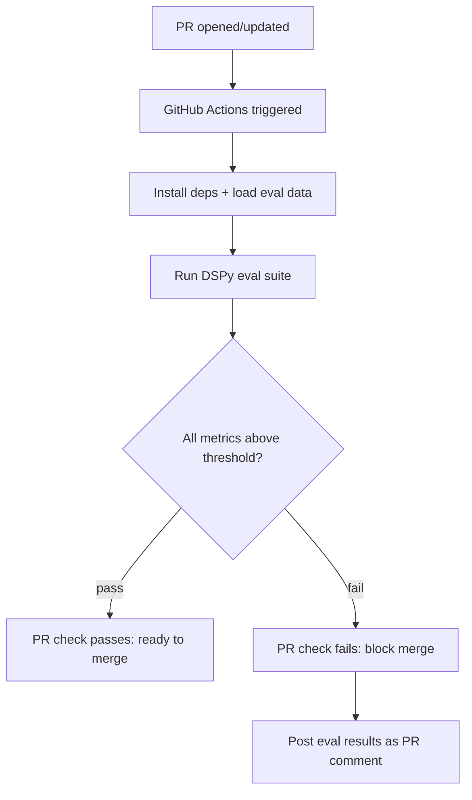

# 11.6: Continuous Evaluation - CI/CD for LLM Applications

## Introduction

Traditional CI/CD catches bugs with unit tests: does the function return the right output? But LLM applications break differently. A prompt change doesn't crash your tests - it silently degrades quality. A model swap doesn't throw an error - it shifts the distribution of outputs. And because LLM calls are non-deterministic, the same input can produce different outputs across runs.

This post shows you how to build a **continuous evaluation pipeline** that runs automated quality checks on every pull request. When someone changes a signature, swaps a model, or modifies optimization settings, the CI pipeline runs your evaluation suite and blocks the merge if accuracy drops below your threshold.

---

## What You'll Learn

- Why traditional CI/CD breaks for LLM applications
- Building a `pytest`-compatible evaluation suite for DSPy signatures
- GitHub Actions workflow: run eval on PR, gate on metric thresholds
- Model swap detection: alert when switching models degrades metrics
- Cost-aware CI: running eval on a subset vs full dataset
- Tracking evaluation scores over time

---

## Prerequisites

- Completed [11.5: Tracing and Observability](../11.5-tracing-observability/blog.md)
- A GitHub repository with DSPy code
- Familiarity with GitHub Actions (or equivalent CI system)
- An evaluation dataset (see [3.1: Building Eval Sets](../../03-evaluation/3.1-building-eval-sets/blog.md) or [3.4: Synthetic Datasets](../../03-evaluation/3.4-synthetic-datasets/blog.md))

---

## The Problem: Silent Quality Regression

Here's a scenario that happens constantly:

1. Developer A changes the signature from `"question -> answer"` to `"question, context -> detailed_answer"`
2. All unit tests pass (signatures are valid, types check out)
3. The PR gets merged
4. Two weeks later, someone notices answer quality dropped 15%

Traditional tests can't catch this because **the program didn't break - it got worse.** You need evaluation tests that measure quality, not just correctness.

---

## Architecture: Eval-Gated CI



---

## Step 1: Structure Your Evaluation Suite

Create a dedicated evaluation directory:

```
tests/
  test_unit.py              # Standard unit tests (fast, no LLM)
  test_eval.py              # LLM evaluation tests (slow, requires API key)
eval/
  datasets/
    qa_dev.json             # Evaluation dataset
  baselines/
    qa_scores.json          # Baseline scores to compare against
  conftest.py               # Shared fixtures for eval tests
```

### Evaluation Fixtures

```python
# eval/conftest.py
import json
import pytest
import dspy


@pytest.fixture(scope="session")
def lm():
    """Configure DSPy with the evaluation model."""
    lm = dspy.LM("openai/gpt-4o-mini")
    dspy.configure(lm=lm)
    return lm


@pytest.fixture(scope="session")
def qa_devset():
    """Load the QA evaluation dataset."""
    with open("eval/datasets/qa_dev.json") as f:
        data = json.load(f)
    return [
        dspy.Example(question=ex["question"], answer=ex["answer"]).with_inputs("question")
        for ex in data
    ]


@pytest.fixture(scope="session")
def qa_baseline():
    """Load baseline scores for comparison."""
    with open("eval/baselines/qa_scores.json") as f:
        return json.load(f)
```

---

## Step 2: Write Evaluation Tests

These tests run your DSPy program on the evaluation set and assert quality thresholds:

```python
# tests/test_eval.py
"""
Evaluation tests for DSPy programs.

These tests require an LLM API key and are slower than unit tests.
Run with: pytest tests/test_eval.py -v --timeout=300
"""

import dspy
from dspy.evaluate import Evaluate
import pytest


# Mark all tests in this file as eval tests
pytestmark = pytest.mark.eval


class TestQAPipeline:
    """Evaluate the QA pipeline against quality thresholds."""

    def setup_method(self):
        self.qa = dspy.ChainOfThought("question -> answer")

    def test_semantic_f1_above_threshold(self, lm, qa_devset):
        """QA pipeline must maintain at least 60% SemanticF1."""
        metric = lambda ex, pred, trace=None: dspy.evaluate.SemanticF1()(ex, pred, trace)

        evaluator = Evaluate(
            devset=qa_devset[:50],  # Use subset for CI speed
            metric=metric,
            num_threads=4,
            display_progress=False,
        )
        score = evaluator(self.qa)

        assert score >= 60.0, (
            f"SemanticF1 dropped to {score:.1f}% (threshold: 60%). "
            f"Check recent signature or model changes."
        )

    def test_no_empty_answers(self, lm, qa_devset):
        """No predictions should return empty answers."""
        empty_count = 0
        sample = qa_devset[:20]

        for ex in sample:
            result = self.qa(question=ex.question)
            if not result.answer or len(result.answer.strip()) < 5:
                empty_count += 1

        empty_rate = empty_count / len(sample) * 100
        assert empty_rate < 10, (
            f"Empty answer rate: {empty_rate:.0f}% ({empty_count}/{len(sample)}). "
            f"Threshold: 10%."
        )

    def test_no_regression_from_baseline(self, lm, qa_devset, qa_baseline):
        """Score must not drop more than 5% from the saved baseline."""
        metric = lambda ex, pred, trace=None: dspy.evaluate.SemanticF1()(ex, pred, trace)

        evaluator = Evaluate(
            devset=qa_devset[:50],
            metric=metric,
            num_threads=4,
            display_progress=False,
        )
        current_score = evaluator(self.qa)
        baseline_score = qa_baseline.get("semantic_f1", 0)

        regression = baseline_score - current_score
        assert regression < 5.0, (
            f"Quality regression detected: {current_score:.1f}% vs baseline "
            f"{baseline_score:.1f}% (delta: -{regression:.1f}%). Max allowed: -5%."
        )
```

---

## Step 3: GitHub Actions Workflow

Create a workflow that runs eval tests on every PR:

```yaml
# .github/workflows/eval.yml
name: DSPy Evaluation

on:
  pull_request:
    paths:
      - "**/*.py"
      - "eval/**"
      - "pyproject.toml"

jobs:
  eval:
    runs-on: ubuntu-latest
    timeout-minutes: 15

    steps:
      - uses: actions/checkout@v4

      - name: Install uv
        uses: astral-sh/setup-uv@v4
        with:
          version: "latest"

      - name: Set up Python
        run: uv python install 3.12

      - name: Install dependencies
        run: uv sync --extra dev

      - name: Run unit tests (fast, no API key)
        run: uv run python -m pytest tests/ -v --ignore=tests/test_eval.py

      - name: Run eval tests (requires API key)
        env:
          OPENAI_API_KEY: ${{ secrets.OPENAI_API_KEY }}
        run: |
          uv run python -m pytest tests/test_eval.py -v \
            --timeout=300 \
            --tb=short \
            -x  # Stop on first failure

      - name: Post eval results
        if: always()
        uses: actions/github-script@v7
        with:
          script: |
            const fs = require('fs');
            // Read pytest output and post as PR comment
            const body = `## DSPy Evaluation Results\n\n` +
              `Status: ${{ job.status }}\n\n` +
              `See workflow logs for detailed metrics.`;
            github.rest.issues.createComment({
              issue_number: context.issue.number,
              owner: context.repo.owner,
              repo: context.repo.repo,
              body: body,
            });
```

### Protecting the Main Branch

In your GitHub repository settings:
1. Go to **Settings > Branches > Branch protection rules**
2. Add a rule for `main`
3. Enable **Require status checks to pass before merging**
4. Select the **DSPy Evaluation** workflow as a required check

Now PRs that degrade quality below your thresholds cannot be merged.

---

## Step 4: Cost-Aware Evaluation

Running the full eval suite on every PR can get expensive. Use stratified sampling:

```python
# eval/sampling.py
import random


def stratified_sample(devset, n=50, seed=42):
    """Take a representative sample for CI evaluation.

    Uses stratified sampling to ensure the subset covers the same
    distribution as the full dataset.
    """
    random.seed(seed)

    if len(devset) <= n:
        return devset

    # If examples have difficulty labels, stratify by difficulty
    difficulties = {}
    for ex in devset:
        diff = getattr(ex, "difficulty", "unknown")
        difficulties.setdefault(diff, []).append(ex)

    sample = []
    for diff, examples in difficulties.items():
        # Proportional allocation
        k = max(1, int(n * len(examples) / len(devset)))
        sample.extend(random.sample(examples, min(k, len(examples))))

    # Fill remaining slots randomly
    remaining = [ex for ex in devset if ex not in sample]
    if len(sample) < n:
        sample.extend(random.sample(remaining, min(n - len(sample), len(remaining))))

    return sample[:n]
```

### Cost Budget Per PR

```python
# Estimated costs per evaluation run
# 50 examples * ~500 tokens each * $0.15/1M input + $0.60/1M output
# = ~$0.02 per eval run with GPT-4o-mini
# Budget: ~$0.50/day for 25 PRs

EVAL_CONFIG = {
    "ci_sample_size": 50,        # Examples per PR eval
    "full_eval_sample_size": 200, # Nightly full eval
    "model": "openai/gpt-4o-mini",
    "max_daily_budget_usd": 0.50,
}
```

At $0.02 per run with GPT-4o-mini, you can evaluate 25 PRs per day for under $0.50.

---

## Step 5: Baseline Management

Keep a record of your best scores so regressions are caught immediately:

```python
# eval/baseline_manager.py
import json
from pathlib import Path
from datetime import datetime


BASELINE_PATH = Path("eval/baselines/qa_scores.json")


def update_baseline(scores: dict):
    """Update the baseline scores after a successful optimization."""
    baseline = {
        "semantic_f1": scores["semantic_f1"],
        "empty_rate": scores["empty_rate"],
        "updated_at": datetime.now().isoformat(),
        "model": scores.get("model", "unknown"),
        "sample_size": scores.get("sample_size", 0),
    }
    BASELINE_PATH.write_text(json.dumps(baseline, indent=2))
    print(f"Baseline updated: {baseline}")


def load_baseline() -> dict:
    """Load the current baseline scores."""
    if BASELINE_PATH.exists():
        return json.loads(BASELINE_PATH.read_text())
    return {"semantic_f1": 0, "empty_rate": 100}
```

Update baselines when you intentionally improve your pipeline:

```bash
# After a successful optimization run
uv run python -c "
from eval.baseline_manager import update_baseline
update_baseline({'semantic_f1': 78.5, 'empty_rate': 2.0, 'model': 'gpt-4o-mini', 'sample_size': 200})
"
```

---

## Step 6: Model Swap Detection

Alert when someone changes the LM configuration:

```python
# tests/test_eval.py (additional test)

class TestModelSwap:
    """Detect and validate model changes."""

    def test_model_matches_baseline(self, qa_baseline):
        """Alert if the configured model differs from baseline."""
        current_model = dspy.settings.lm.model if dspy.settings.lm else "none"
        baseline_model = qa_baseline.get("model", "unknown")

        if current_model != baseline_model:
            pytest.skip(
                f"Model changed from '{baseline_model}' to '{current_model}'. "
                f"Run full eval to establish new baseline."
            )
```

---

## Nightly Full Evaluation

Run the complete evaluation suite nightly, not just on PRs:

```yaml
# .github/workflows/nightly-eval.yml
name: Nightly Full Evaluation

on:
  schedule:
    - cron: "0 2 * * *"  # 2 AM UTC daily
  workflow_dispatch:

jobs:
  full-eval:
    runs-on: ubuntu-latest
    timeout-minutes: 30

    steps:
      - uses: actions/checkout@v4

      - name: Install uv
        uses: astral-sh/setup-uv@v4
        with:
          version: "latest"

      - name: Set up Python
        run: uv python install 3.12

      - name: Install dependencies
        run: uv sync --extra dev

      - name: Run full evaluation
        env:
          OPENAI_API_KEY: ${{ secrets.OPENAI_API_KEY }}
          EVAL_SAMPLE_SIZE: "200"
        run: |
          uv run python -m pytest tests/test_eval.py -v \
            --timeout=600 \
            --tb=long
```

---

## Key Takeaways

- **LLM apps need eval tests, not just unit tests.** Unit tests catch crashes. Eval tests catch quality regressions.
- **Gate PRs on metric thresholds.** If SemanticF1 drops more than 5%, block the merge. This single rule prevents most silent degradations.
- **Use subset evaluation for PRs, full evaluation nightly.** 50 examples costs ~$0.02 per run with GPT-4o-mini. Run the full 200+ set overnight.
- **Track baselines explicitly.** Save your best scores to a JSON file. Compare every PR against the baseline.
- **Model swaps need re-evaluation.** Changing from GPT-4o to GPT-4o-mini isn't a bug; it's a trade-off. But the CI should flag it and require a new baseline.

---

## Next Up

You've now built the complete production engineering stack: caching, async, deployment, debugging, tracing, and continuous evaluation. Time to push into advanced territory.

**[Phase 12: Advanced Architectures and Research →](../../12-advanced/12.1-real-world-architectures/blog.md)**

---

## Resources

- [GitHub Actions Documentation](https://docs.github.com/en/actions)
- [DSPy Evaluate API](https://dspy.ai/api/evaluate/)
- [Pytest Documentation](https://docs.pytest.org/)
- [Code examples for this post](code/)
